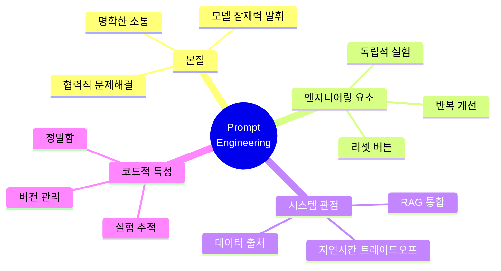
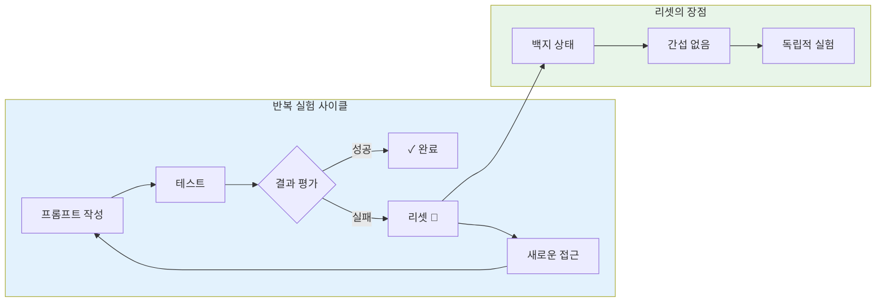

# 나노바나나 치트시트 프롬프트: AI Prompt Engineering Deep Dive - Defining Prompt Engineering

## 콘텐츠 정보

- **원본**: AI Prompt Engineering: A Deep Dive by Anthropic
- **챕터**: 2. Defining Prompt Engineering (프롬프트 엔지니어링 정의하기)
- **유형**: 라운드테이블 토론 (Roundtable Discussion)
- **패널**: Alex Albert, David Hershey, Amanda Askell, Zack Witten

---

## 프롬프트

다음 라운드테이블 토론 내용을 바탕으로 A4 한 장 분량의 학습 치트시트를 생성해주세요.

### 토론 내용

**제목**: AI Prompt Engineering Deep Dive - Chapter 2: Defining Prompt Engineering

**세션 개요**:
프롬프트 엔지니어링의 정의와 왜 "엔지니어링"이라고 부르는지에 대해 토론합니다. 명확한 소통의 본질과 리셋 버튼의 개념, 시스템 통합 관점에서의 프롬프팅을 다룹니다.

**핵심 학습 내용**:

1. **프롬프트 엔지니어링의 본질**
   - 모델이 원하는 작업을 하도록 만드는 것
   - 모델의 잠재력을 최대한 끌어내는 것
   - 모델과 협력해서 혼자서는 할 수 없었던 일을 해내는 것
   - **본질은 명확한 소통** - 사람과 대화하는 것과 비슷

2. **왜 "엔지니어링"인가?**
   - **리셋 버튼의 존재** - 완전히 처음으로 돌아가서 새로 시작 가능
   - 백지 상태에서 독립적으로 다양한 것들을 시도
   - 실험하고 다양한 설계를 해볼 수 있는 능력
   - 시행착오를 통한 반복 개선

3. **시스템 통합 관점**
   - 프롬프트 하나 작성해서 끝나는 게 아님
   - 데이터가 어디서 오는지 고려
   - RAG 사용 시 무엇을 모델에 전달할지
   - 지연 시간과 데이터 양의 트레이드오프

4. **프롬프트는 코드인가?**
   - "자연어 코드"의 측면이 있음
   - 버전 관리와 실험 추적이 코드만큼 중요
   - 너무 추상적으로 접근하면 복잡해짐
   - 명확한 작업 설명이 핵심

5. **핵심 인사이트**
   > "모델과 대화하는 건 사람과 대화하는 것과 비슷합니다. 모델의 심리를 깊이 이해하는 것이 중요합니다." - Zack

   > "프롬프트를 모델을 프로그래밍하는 방법이라고 생각합니다." - David

   > "좋은 에세이 같은 글이 코드와 같은 것처럼 보이는 게 이상하지만, 그게 실제로 맞습니다." - Zack

### 치트시트 생성 지시사항

# Layout Structure (이 구조대로 배치해주세요)

**IMPORTANT**: 첨부된 이미지는 스타일(손필기 느낌, 모눈종이 배경, 아이콘)만 참조하세요. 레이아웃은 아래 지정된 구조를 따라 새로 만들어주세요.

```
┌─────────────────────────────────────────────────────────────────────┐
│  🍌 NANO BANANA CHEAT SHEET: DEFINING PROMPT ENGINEERING 🍌         │
├─────────────────────────────────────────────────────────────────────┤
│  ┌─────────────────────────┐    ┌─────────────────────────────────┐│
│  │ 🎯 PE의 본질            │    │ 🔄 왜 "엔지니어링"인가?         ││
│  │                         │    │                                 ││
│  │  모델의 잠재력을         │    │  리셋 버튼의 존재!              ││
│  │  최대한 끌어내는 것       │    │  백지상태에서 실험 가능          ││
│  │  = 명확한 소통           │    │  시행착오 통한 반복 개선         ││
│  └─────────────────────────┘    └─────────────────────────────────┘│
├─────────────────────────────────────────────────────────────────────┤
│  ⚡ THE RESET BUTTON CONCEPT (이 섹션이 가장 넓어야 함!)             │
│  ┌───────────────────────────────────────────────────────────────┐ │
│  │                                                               │ │
│  │  ┌──────┐    ┌──────┐    ┌──────┐    ┌──────┐               │ │
│  │  │시도 1│ → │리셋  │ → │시도 2│ → │리셋  │ → ...           │ │
│  │  └──────┘    └──────┘    └──────┘    └──────┘               │ │
│  │                                                               │ │
│  │  "백지 상태에서 서로 간섭 없이 독립적으로 다양한 것들을          │ │
│  │   시도해 볼 수 있어요. 바로 거기서 엔지니어링의 가능성이 나옵니다" │ │
│  │                                                               │ │
│  └───────────────────────────────────────────────────────────────┘ │
├─────────────────────────────────────────────────────────────────────┤
│  ┌───────────────────┐ ┌───────────────────┐ ┌───────────────────┐│
│  │ 🔧 시스템 통합     │ │ 📝 코드로서의 프롬프트│ │ 📌 KEY TAKEAWAYS ││
│  │                   │ │                   │ │                   ││
│  │ 데이터 출처 고려   │ │ 버전 관리 필요     │ │ 소통 + 반복      ││
│  │ RAG 트레이드오프   │ │ 실험 추적 중요     │ │ + 시스템 사고    ││
│  └───────────────────┘ └───────────────────┘ └───────────────────┘│
└─────────────────────────────────────────────────────────────────────┘
```

## 배치 비율

| 영역 | 비율 | 내용 | 배치 |
|------|------|------|------|
| 상단 | 10% | 타이틀 | 전체 너비 |
| 중상단 | 20% | PE의 본질 + 왜 엔지니어링인가 | **좌우 2등분** |
| 중앙 | 45% | The Reset Button Concept | **가장 넓게!** |
| 하단 | 25% | 시스템 통합 + 코드로서의 프롬프트 + Takeaways | **3등분** |

**2. 필수 시각 요소**

#### Mermaid 다이어그램 1: PE 정의 마인드맵



#### Mermaid 다이어그램 2: 리셋 버튼 플로우



**3. PE 정의 비교 테이블**

| 관점 | 정의 | 핵심 요소 | 발언자 |
|:---:|:---|:---|:---|
| **소통** | 모델과 명확하게 대화하는 것 | 모델 심리 이해 | Zack |
| **잠재력** | 모델이 최대한 능력 발휘하게 | 협력적 문제해결 | Zack |
| **프로그래밍** | 모델을 프로그래밍하는 방법 | 시스템적 사고 | David |
| **실험** | 리셋 버튼으로 반복 시도 | 시행착오 | Zack |

**4. 프롬프트 vs 코드 비교**

| 측면 | 프롬프트 | 코드 |
|:---:|:---|:---|
| **형태** | 자연어 | 프로그래밍 언어 |
| **버전 관리** | 필요 ✅ | 필요 ✅ |
| **실험 추적** | 필요 ✅ | 필요 ✅ |
| **정밀함** | 매우 중요 | 매우 중요 |
| **추상화 수준** | 높음 (자연어) | 중간~낮음 |

**5. 사람과 대화 vs 모델과 대화**

| Aspect | 사람과 대화 | 모델과 대화 |
|:---:|:---:|:---:|
| 리셋 | ❌ 불가능 | ✅ 가능 |
| 독립 실험 | ❌ 불가능 | ✅ 가능 |
| 명확한 소통 | ✅ 필요 | ✅ 필요 |
| 심리 이해 | ✅ 필요 | ✅ 필요 |
| 맥락 기억 | ✅ 자동 | ⚠️ 제한적 |

**6. 강조 박스 (Callout)**

> **핵심 인사이트: 리셋 버튼**
>
> "완전히 처음으로 돌아가서 새로 시작할 수 있는 버튼이 있어요. 이 기능 덕분에 진짜로 **백지 상태**에서 시작해서 서로 **간섭 없이 독립적으로** 다양한 것들을 시도해 볼 수 있어요. 바로 거기서 **엔지니어링의 가능성**이 나오는 거죠."
> - Zack Witten

> **시스템 통합의 중요성**
>
> "프롬프트 하나 작성해서 모델에 주면 끝나는 게 **아니에요**. 사실 **전혀 그렇지 않아요**. 훨씬 더 복잡하죠."
> - Zack (David의 경험 언급하며)

> **프롬프트 = 자연어 코드**
>
> "좋은 에세이 같은 글이 코드와 같은 것처럼 보이는 게 이상하지만, 그게 **실제로 맞습니다**."

**7. 키워드 박스**

핵심 용어:
- **Prompt Engineering (PE)**: 모델의 잠재력을 최대한 끌어내는 기술
- **Reset Button**: 리셋 버튼 - 백지 상태에서 독립적 실험을 가능하게 하는 특성
- **Clear Communication**: 명확한 소통 - PE의 가장 기본적인 본질
- **System Integration**: 시스템 통합 - 프롬프트를 전체 시스템 맥락에서 고려
- **RAG (Retrieval-Augmented Generation)**: 검색 증강 생성 - 외부 데이터와 모델 결합
- **Version Control**: 버전 관리 - 프롬프트도 코드처럼 버전 관리 필요
- **Latency Trade-off**: 지연시간 트레이드오프 - 데이터 양과 응답 속도 균형

**8. 시리즈 구조**

```
┌──────────────────────────────────────────────────────────┐
│  AI Prompt Engineering: A Deep Dive (전체 11개 챕터)      │
├──────────────────────────────────────────────────────────┤
│  1. Introduction                                         │
│  2. Defining Prompt Engineering ◀── 현재 챕터            │
│  3. What Makes a Good Prompt Engineer                    │
│  4. Refining Prompts                                     │
│  5. Honesty, Personas & Metaphors                        │
│  6. Model Reasoning                                      │
│  7. Enterprise vs Research vs Chat                       │
│  8. Tips to Improve                                      │
│  9. Jailbreaking                                         │
│  10. Evolution of PE                                     │
│  11. Future of PE                                        │
└──────────────────────────────────────────────────────────┘
```

### 스타일 가이드

- **색상 테마**: 파란색/청록색 계열 (기술/시스템 느낌)
- **폰트**: 깔끔한 산세리프
- **아이콘**: 리셋 화살표, 톱니바퀴, 코드 기호, 대화 버블
- **강조**: 핵심 용어는 **굵게**, 인용구는 블록 인용

### 추가 요청사항

1. 16:9 가로형 (Landscape) 레이아웃
2. 리셋 버튼 개념을 시각적으로 강조 (순환 화살표 아이콘)
3. 하단에 "챕터 2/11" 표시
4. 시리즈 일관성을 위한 헤더/푸터 디자인

---

## 메타 정보

- **생성일**: 2026-01-10
- **원본 파일**: `docs/week1/ai-prompt-engineering-deep-dive/kr/defining-prompt-engineering.md`
- **출력 형식**: 나노바나나 Pro 치트시트 프롬프트

---

## 이미지 생성 요청

위의 구조와 내용을 바탕으로 **A4 한 장 분량의 치트시트 이미지**를 생성해주세요.

**이미지 스타일 요구사항:**
- 보기 좋게 정리된 **실제 펜 노트필기** 같은 느낌
- 용어 및 고유명사는 **영어 원문** 유지
- 설명 및 필기 내용은 **한국어**로 작성
- Mermaid 다이어그램은 **시각적 도식**으로 변환
- 표는 깔끔한 **테이블 형식**으로 렌더링
- **색상 강조**로 핵심 개념 구분

**가로세로 비율**: 16:9 가로형 (Landscape orientation)
