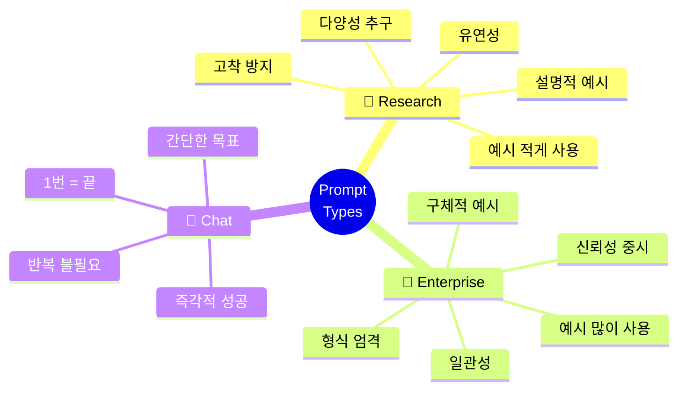
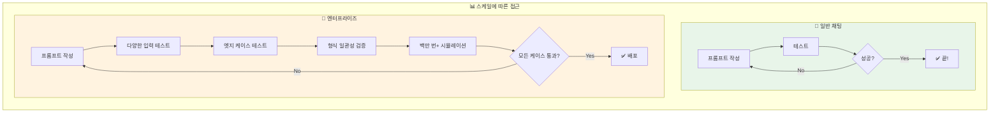
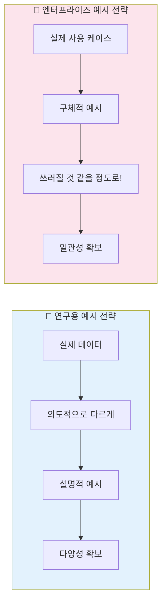

# 나노바나나 치트시트 프롬프트: AI Prompt Engineering Deep Dive - Enterprise vs Research vs Chat

## 콘텐츠 정보

- **원본**: AI Prompt Engineering: A Deep Dive by Anthropic
- **챕터**: 7. Enterprise vs Research vs General Chat Prompts (엔터프라이즈 vs 연구 vs 일반 채팅 프롬프트)
- **유형**: 라운드테이블 토론 (Roundtable Discussion)
- **패널**: Alex Albert, David Hershey, Amanda Askell, Zack Witten
- **타임스탬프**: 45:18
- **소스 URL**: https://www.youtube.com/watch?v=T9aRN5JkmL8&t=2718s

---

## 프롬프트

다음 라운드테이블 토론 내용을 바탕으로 A4 한 장 분량의 학습 치트시트를 생성해주세요.

### 토론 내용

**제목**: AI Prompt Engineering Deep Dive - Chapter 7: Enterprise vs Research vs General Chat Prompts

**세션 개요**:
세 가지 유형의 프롬프트 작성 방식의 근본적인 차이를 비교합니다. 연구용 프롬프트는 다양성과 유연성을, 엔터프라이즈 프롬프트는 신뢰성과 일관성을, 일반 채팅 프롬프트는 즉각적인 성공을 추구합니다. 특히 **스케일의 차이**가 전략을 결정하는 핵심 요소입니다.

**핵심 학습 내용**:

1. **세 가지 프롬프트 유형의 목표**
   - **연구용 (Research)**: 다양성과 변화 추구, 모델이 탐색할 가능성의 범위 활용
   - **엔터프라이즈 (Enterprise)**: 신뢰성과 일관성 중시, 형식을 엄청나게 신경 씀
   - **일반 채팅 (Chat)**: 한 번 성공하면 끝, 즉각적인 결과 도출

2. **예시 사용 전략의 차이**
   - **연구용**: 예시를 적게 사용 (너무 적으면 모델이 그것에 고착)
   - **엔터프라이즈**: 예시를 "미친 듯이" 많이 사용 (쓰러질 것 같을 정도로!)
   - 연구용 예시는 실제 데이터와 **의도적으로 다르게** 만듦 (설명적 예시)
   - 엔터프라이즈 예시는 **구체적**이고 실제 사용 케이스와 유사하게

3. **스케일의 결정적 차이**
   - **일반 채팅**: 1번 성공 = 끝 ✓
   - **엔터프라이즈**: 백만 번, 천만 번, 억 번 사용
   - 전체 입력 범위와 모든 사용 방식에 대한 테스트 필수
   - 들이는 정성의 차이는 **스케일의 차이**에서 비롯

4. **Amanda vs Zack: 대조적인 접근법**
   - **Amanda (연구 팀)**: 예시 많이 넣는 것 별로 안 좋아함
   - **Zack (엔터프라이즈)**: "예시를 미친 듯이 추가하는 걸 좋아해요"
   - 두 접근 모두 세심함과 뉘앙스 측면에서는 비슷

5. **핵심 인사이트**
   > "Amanda는 예시를 많이 넣는 걸 별로 좋아하지 않아요. 너무 적으면 모델이 그것에 고착되거든요." - Zack (연구용 프롬프팅에 대해)

   > "저는 예시를 **미친 듯이** 추가하는 걸 좋아해요. **쓰러질 것 같을 정도로** 많이 넣을 때까지요." - Zack (엔터프라이즈 프롬프팅에 대해)

   > "엔터프라이즈에서는 신뢰성을 정말 중요하게 여기기 때문이에요. 형식을 엄청나게 신경 쓰고, 모든 답변이 동일해도 괜찮아요." - Zack

   > "Claude.ai에서 사용할 프롬프트를 쓸 때는 한 번 맞을 때까지 반복하는 거예요. 그러면 끝이에요." - David (일반 채팅에 대해)

   > "엔터프라이즈 프롬프트는 이걸 **백만 번**이나 천만 번, 아니면 **억 번** 사용할 거잖아요. 그래서 모든 범위의 입력 데이터에 대해 테스트하는 거예요." - David

### 치트시트 생성 지시사항

# Layout Structure (이 구조대로 배치해주세요)

**IMPORTANT**: 첨부된 이미지는 스타일(손필기 느낌, 모눈종이 배경, 아이콘)만 참조하세요. 레이아웃은 아래 지정된 구조를 따라 새로 만들어주세요.

```
┌─────────────────────────────────────────────────────────────────────┐
│  🍌 NANO BANANA CHEAT SHEET: ENTERPRISE vs RESEARCH vs CHAT 🍌      │
├─────────────────────────────────────────────────────────────────────┤
│  ┌─────────────────────────┐    ┌─────────────────────────────────┐│
│  │ 🔬 RESEARCH             │    │ 🏢 ENTERPRISE                   ││
│  │                         │    │                                 ││
│  │  • 다양성, 유연성 추구   │    │  • 신뢰성, 일관성 중시          ││
│  │  • 예시 적게 사용        │    │  • 예시 많이 사용               ││
│  │  • 설명적 예시 선호      │    │  • 구체적 예시 선호             ││
│  │  • 고착 방지            │    │  • 형식 일관성 중시             ││
│  └─────────────────────────┘    └─────────────────────────────────┘│
├─────────────────────────────────────────────────────────────────────┤
│  ⚡ THE SCALE DIFFERENCE (이 섹션이 가장 넓어야 함!)                 │
│  ┌───────────────────────────────────────────────────────────────┐ │
│  │                                                               │ │
│  │  Chat:       [1번] ──────────────────→ ✓ 끝!                  │ │
│  │  Research:   [10-100번] ─────────────→ 다양한 출력 탐색        │ │
│  │  Enterprise: [1,000,000번+] ─────────→ 전체 입력 범위 테스트   │ │
│  │                                                               │ │
│  │  ⚠️ "백만 번, 천만 번, 아니면 억 번 사용할 거잖아요"            │ │
│  │                                                               │ │
│  └───────────────────────────────────────────────────────────────┘ │
├─────────────────────────────────────────────────────────────────────┤
│  ┌───────────────────┐ ┌───────────────────┐ ┌───────────────────┐│
│  │ 📝 예시 전략       │ │ 💬 CHAT           │ │ 📌 KEY TAKEAWAYS  ││
│  │                   │ │                   │ │                   ││
│  │ 연구: 설명적 예시  │ │ 한 번 성공 = 끝   │ │ 스케일이 전략 결정  ││
│  │ 기업: 구체적 예시  │ │ 반복 불필요       │ │ 용도에 맞는 접근    ││
│  │ "미친듯이 추가"   │ │ 즉각적 결과       │ │ 예시 전략 조절      ││
│  └───────────────────┘ └───────────────────┘ └───────────────────┘│
└─────────────────────────────────────────────────────────────────────┘
```

## 배치 비율

| 영역 | 비율 | 내용 | 배치 |
|------|------|------|------|
| 상단 | 10% | 타이틀 | 전체 너비 |
| 중상단 | 20% | Research vs Enterprise | **좌우 2등분** |
| 중앙 | 45% | The Scale Difference | **가장 넓게!** |
| 하단 | 25% | 예시 전략 + Chat + Takeaways | **3등분** |

**2. 필수 시각 요소**

#### Mermaid 다이어그램 1: 세 가지 유형 비교 마인드맵



#### Mermaid 다이어그램 2: 스케일에 따른 테스트 범위 플로우



#### Mermaid 다이어그램 3: 예시 전략 비교 플로우



**3. 세 가지 유형 종합 비교 테이블**

| Aspect | 🔬 Research | 🏢 Enterprise | 💬 Chat |
|:---:|:---|:---|:---|
| **목표** | 다양성, 탐색 | 신뢰성, 일관성 | 즉시 결과 |
| **예시 사용** | 적게 (설명적) | 많이 (구체적) | 상황에 따라 |
| **반복 횟수** | 다양한 출력 필요 | 백만 번+ 일관성 | 1번 성공 = 끝 |
| **테스트 범위** | 좁음 | 전체 입력 범위 | 현재 케이스만 |
| **형식 중요도** | 낮음 (유연성) | 매우 높음 | 상관없음 |
| **대표 인물** | Amanda Askell | Zack, David | 일반 사용자 |

**4. 예시 전략 상세 비교 테이블**

| 측면 | 🔬 연구용 예시 | 🏢 엔터프라이즈 예시 |
|:---:|:---|:---|
| **예시 수** | 0-2개 (너무 적으면 고착) | "미친 듯이" 많이 (쓰러질 정도로) |
| **예시 특성** | 실제 데이터와 의도적으로 다름 | 실제 사용 케이스와 유사 |
| **목적** | 유연성과 다양성 확보 | 형식 일관성과 신뢰성 확보 |
| **고착 우려** | ⚠️ 너무 적으면 고착 | ✅ 많으면 일관성 향상 |
| **Amanda의 선호** | ✅ 선호 | ❌ 비선호 |
| **Zack의 선호** | ❌ 비선호 | ✅ 선호 |

**5. 스케일별 정성 투입 비교**

| 스케일 | 사용 횟수 | 테스트 범위 | 정성 수준 |
|:---:|:---:|:---|:---|
| Chat | 1번 | 현재 케이스만 | ★☆☆☆☆ |
| Research | 10-100번 | 다양한 출력 탐색 | ★★★☆☆ |
| Enterprise | 1,000,000번+ | 전체 입력 범위 | ★★★★★ |

**6. 강조 박스 (Callout)**

> **Zack의 엔터프라이즈 예시 철학** 🔥
>
> "저는 예시를 **미친 듯이** 추가하는 걸 좋아해요. **쓰러질 것 같을 정도로** 많이 넣을 때까지요. 그 이유는 소비자용 애플리케이션에서는 **신뢰성**을 정말 중요하게 여기기 때문이에요. **형식을 엄청나게 신경 쓰고**, 모든 답변이 **동일해도 괜찮아요**."
> - Zack Witten

> **Amanda의 연구용 예시 철학** 🔬
>
> "Amanda는 예시를 많이 넣는 걸 별로 좋아하지 않아요. 너무 적으면 모델이 그것에 **고착**되거든요. 연구용으로 프롬프트를 작성할 때는 모델이 **탐색할 수 있는 가능성의 범위**를 정말로 활용하려고 해요."
> - Zack (Amanda의 접근법 설명)

> **David의 스케일 통찰** 📈
>
> "Claude.ai에서 사용할 프롬프트를 쓸 때는 **한 번 맞을 때까지** 반복하는 거예요. 그러면 **끝이에요**. 반면에 대부분의 엔터프라이즈 프롬프트는 이걸 **백만 번**이나 천만 번, 아니면 **억 번** 사용할 거잖아요."
> - David Hershey

> **설명적 예시 vs 구체적 예시** 💡
>
> "저는 예시를 줄 때, **실제로 모델이 볼 데이터와 다른 예시**를 만들려고 해요. 의도적으로 **설명을 위한 예시**로요. 더 많은 유연성과 다양성을 원한다면, 구체적인 예시보다 **설명적인 예시**를 사용할 거예요."
> - Amanda Askell (연구 팀)

**7. 키워드 박스**

핵심 용어:
- **Enterprise Prompts (엔터프라이즈 프롬프트)**: 대규모 상용 애플리케이션용 프롬프트, 신뢰성과 일관성 최우선
- **Research Prompts (연구용 프롬프트)**: 모델의 가능성 탐색용 프롬프트, 다양성과 유연성 추구
- **Chat Prompts (일반 채팅 프롬프트)**: 개인용 1회성 프롬프트, 즉각적인 성공이 목표
- **Illustrative Examples (설명적 예시)**: 실제 데이터와 의도적으로 다른 예시, 모델 고착 방지
- **Specific Examples (구체적 예시)**: 실제 사용 케이스와 유사한 예시, 형식 일관성 확보
- **Scale Testing (스케일 테스팅)**: 전체 입력 범위와 모든 사용 방식에 대한 테스트
- **Format Consistency (형식 일관성)**: 엔터프라이즈에서 모든 답변이 동일한 형식을 유지하는 것
- **Model Fixation (모델 고착)**: 예시가 너무 적을 때 모델이 특정 패턴에 갇히는 현상

**8. 시리즈 구조**

```
┌──────────────────────────────────────────────────────────┐
│  AI Prompt Engineering: A Deep Dive (전체 11개 챕터)      │
├──────────────────────────────────────────────────────────┤
│  1. Introduction                                         │
│  2. Defining Prompt Engineering                          │
│  3. What Makes a Good Prompt Engineer                    │
│  4. Refining Prompts                                     │
│  5. Honesty, Personas & Metaphors                        │
│  6. Model Reasoning                                      │
│  7. Enterprise vs Research vs Chat ◀── 현재 챕터         │
│  8. Tips to Improve                                      │
│  9. Jailbreaking                                         │
│  10. Evolution of PE                                     │
│  11. Future of PE                                        │
└──────────────────────────────────────────────────────────┘
```

### 스타일 가이드

- **색상 테마**:
  - 연구용: 파란색 계열 (탐색/학술 느낌)
  - 엔터프라이즈: 주황색/금색 계열 (비즈니스/신뢰 느낌)
  - 채팅: 초록색 계열 (간단/완료 느낌)
- **폰트**: 깔끔한 산세리프
- **아이콘**: 현미경 (연구), 빌딩 (엔터프라이즈), 말풍선 (채팅), 스케일/저울
- **강조**: 핵심 용어는 **굵게**, 인용구는 블록 인용, Zack의 "미친 듯이" 강조

### 추가 요청사항

1. 16:9 가로형 (Landscape) 레이아웃
2. 스케일 차이를 시각적으로 강조 (1 vs 1,000,000+ 막대그래프)
3. 하단에 "챕터 7/11" 표시
4. 시리즈 일관성을 위한 헤더/푸터 디자인
5. 세 유형을 색상으로 명확히 구분

---

## 메타 정보

- **생성일**: 2026-01-11
- **원본 파일**: `docs/week1/ai-prompt-engineering-deep-dive/kr/enterprise-vs-research-vs-chat.md`
- **출력 형식**: 나노바나나 Pro 치트시트 프롬프트

---

## 이미지 생성 요청

위의 구조와 내용을 바탕으로 **A4 한 장 분량의 치트시트 이미지**를 생성해주세요.

**이미지 스타일 요구사항:**
- 보기 좋게 정리된 **실제 펜 노트필기** 같은 느낌
- 용어 및 고유명사는 **영어 원문** 유지
- 설명 및 필기 내용은 **한국어**로 작성
- Mermaid 다이어그램은 **시각적 도식**으로 변환
- 표는 깔끔한 **테이블 형식**으로 렌더링
- **색상 강조**로 세 가지 유형 구분 (파랑/주황/초록)
- Zack의 "미친 듯이 추가" 인용을 특별히 강조

**가로세로 비율**: 16:9 가로형 (Landscape orientation)
