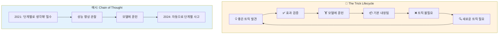
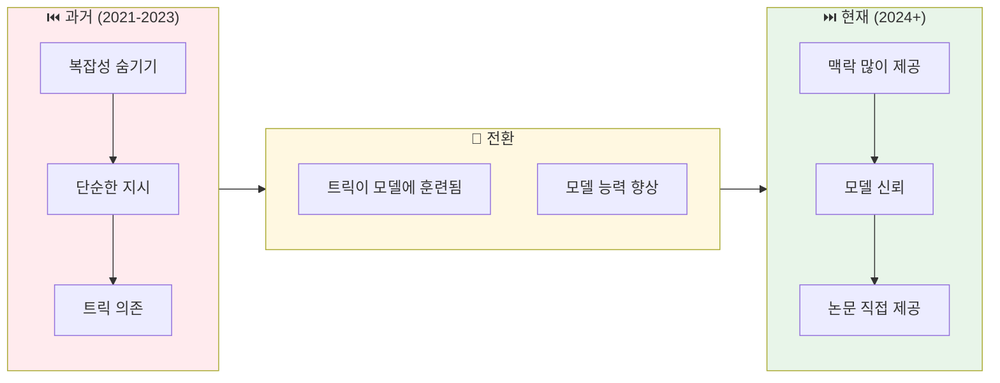
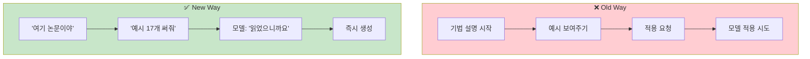

# 나노바나나 치트시트 프롬프트: AI Prompt Engineering Deep Dive - Evolution of Prompt Engineering

## 콘텐츠 정보

- **원본**: AI Prompt Engineering: A Deep Dive by Anthropic
- **챕터**: 10. Evolution of Prompt Engineering (프롬프트 엔지니어링의 진화)
- **유형**: 라운드테이블 토론 (Roundtable Discussion)
- **패널**: Alex Albert, David Hershey, Amanda Askell, Zack Witten
- **타임스탬프**: 56:51

---

## 프롬프트

다음 라운드테이블 토론 내용을 바탕으로 A4 한 장 분량의 학습 치트시트를 생성해주세요.

### 토론 내용

**제목**: AI Prompt Engineering Deep Dive - Chapter 10: Evolution of Prompt Engineering

**세션 개요**:
지난 3년간 프롬프트 엔지니어링이 어떻게 변화했는지 논의합니다. 좋은 트릭이 발견되면 모델에 훈련되어 불필요해지는 수명 주기, 모델에 대한 신뢰와 존중의 변화, 그리고 논문을 직접 제공하는 새로운 접근법을 다룹니다.

**핵심 학습 내용**:

1. **트릭의 수명 주기 (Trick Lifecycle)**
   - 좋은 프롬프팅 핵/트릭 발견
   - 효과 검증 및 확산
   - 모델에 훈련시킴 (Training into model)
   - 트릭이 불필요해짐 (Obsolete)
   - 새로운 트릭 발견으로 순환
   - **"가장 좋은 것들은 항상 수명이 짧습니다"** - Amanda

2. **Chain of Thought의 진화**
   - 2021-2022: "단계별로 생각해" 명시적 요청 필수
   - 효과: 엄청난 성능 향상 관찰
   - 훈련 결정: 모델이 자연스럽게 단계별 사고하도록
   - 2024+: 수학 문제에서 더 이상 명시 불필요
   - **예외**: 예시와 Chain of Thought는 영구적 (커뮤니케이션 수준)

3. **모델에 대한 신뢰의 변화**
   - **과거**: 의도적으로 모델에게 복잡성 숨김
   - **현재**: 더 많은 맥락과 정보를 신뢰하며 제공
   - 모델에 대한 "일반적인 존중" 증가
   - 얼마나 많은 맥락을 줄 수 있는지 확장

4. **논문 직접 제공 접근법 (Paper-Feeding Approach)**
   - **과거 방식**: 프롬프팅 기법 설명 시작 → 예시 보여주기 → 적용 요청
   - **현재 방식**: "여기 논문이야. 읽고 예시 17개 써줘."
   - 모델의 응답: "논문을 읽었으니까요." → 그냥 함
   - 복잡성을 숨기기보다 모델을 존중하고 신뢰하기

5. **핵심 인사이트**
   > "정말 좋은 프롬프트 엔지니어링 핵이나 트릭을 발견할 때마다, 다음 단계는 이걸 어떻게 모델에 훈련시킬 것인가입니다. 그래서 가장 좋은 것들은 항상 수명이 짧습니다." - Amanda

   > "수학의 경우, 예전에는 '단계별로 생각해'라고 말해야 했지만, 이제는 그렇게 하지 않아도 됩니다." - 모델에 훈련됨

   > "논문을 줘. '여기 프롬프팅 기법에 대한 논문이 있어. 이것의 예시 17개만 작성해 줘.' 그러면 그냥 해요. 왜냐하면 논문을 읽었으니까요."

### 치트시트 생성 지시사항

# Layout Structure (이 구조대로 배치해주세요)

**IMPORTANT**: 첨부된 이미지는 스타일(손필기 느낌, 모눈종이 배경, 아이콘)만 참조하세요. 레이아웃은 아래 지정된 구조를 따라 새로 만들어주세요.

```
┌─────────────────────────────────────────────────────────────────────┐
│  🍌 NANO BANANA CHEAT SHEET: EVOLUTION OF PROMPT ENGINEERING 🍌     │
├─────────────────────────────────────────────────────────────────────┤
│  ┌─────────────────────────┐    ┌─────────────────────────────────┐│
│  │ ⏮️ PAST (2021-2023)     │    │ ⏭️ PRESENT (2024+)              ││
│  │                         │    │                                 ││
│  │  "단계별로 생각해" 필수   │    │  이미 모델에 내장               ││
│  │  복잡성 숨기기           │    │  맥락 많이 제공                  ││
│  │  핵/트릭 중심            │    │  모델 신뢰 + 존중               ││
│  │  기법 설명 후 적용       │    │  논문 직접 제공                  ││
│  └─────────────────────────┘    └─────────────────────────────────┘│
├─────────────────────────────────────────────────────────────────────┤
│  ⚡ THE TRICK LIFECYCLE (이 섹션이 가장 넓어야 함!)                  │
│  ┌───────────────────────────────────────────────────────────────┐ │
│  │                                                               │ │
│  │  [순환 다이어그램]                                              │ │
│  │  좋은 트릭 발견 → 효과 검증 → 모델에 훈련 → 불필요해짐          │ │
│  │       ↑                                            ↓          │ │
│  │       └─────────── 새 트릭 필요 ←─────────────────┘           │ │
│  │                                                               │ │
│  │  "가장 좋은 것들은 항상 수명이 짧습니다" - Amanda                │ │
│  │                                                               │ │
│  └───────────────────────────────────────────────────────────────┘ │
├─────────────────────────────────────────────────────────────────────┤
│  ┌───────────────────┐ ┌───────────────────┐ ┌───────────────────┐│
│  │ 📄 논문 직접 제공  │ │ 🎯 영구적인 것들   │ │ 📌 KEY TAKEAWAYS ││
│  │                   │ │                   │ │                   ││
│  │ "여기 논문.       │ │ 예시 (Examples)   │ │ 트릭 → 훈련 → 불필요││
│  │  예시 17개 써줘"  │ │ Chain of Thought  │ │ 모델 신뢰가 핵심   ││
│  │  → "읽었으니까요" │ │ = 커뮤니케이션    │ │ 맥락 많이 제공     ││
│  └───────────────────┘ └───────────────────┘ └───────────────────┘│
└─────────────────────────────────────────────────────────────────────┘
```

## 배치 비율

| 영역 | 비율 | 내용 | 배치 |
|------|------|------|------|
| 상단 | 10% | 타이틀 | 전체 너비 |
| 중상단 | 20% | Past vs Present | **좌우 2등분** |
| 중앙 | 45% | The Trick Lifecycle | **가장 넓게!** |
| 하단 | 25% | 논문 제공 + 영구적인 것들 + Takeaways | **3등분** |

**2. 필수 시각 요소**

#### Mermaid 다이어그램 1: The Trick Lifecycle (순환)



#### Mermaid 다이어그램 2: 신뢰 수준의 진화



#### Mermaid 다이어그램 3: 논문 제공 접근법 비교



**3. Evolution Timeline 테이블**

| Era | 접근 방식 | 예시 | 상태 |
|:---:|:---|:---|:---:|
| **2021-2022** | 핵/트릭 중심 | "단계별로 생각해" | 필수였음 |
| **2023** | 전환기 | 일부 트릭 모델에 내장 | 변화 중 |
| **2024+** | 신뢰 기반 | 맥락 많이 제공, 논문 직접 제공 | 현재 권장 |

**4. 과거 vs 현재 비교 테이블**

| Aspect | ⏮️ Past (2021-2023) | ⏭️ Present (2024+) |
|:---:|:---:|:---:|
| **Chain of Thought** | "단계별로 생각해" 필수 | 모델에 내장, 자동 |
| **복잡성 처리** | 숨기기 | 모델에 신뢰하며 제공 |
| **맥락 양** | 제한적 | 더 많이 제공 |
| **기법 전달** | 설명 후 적용 | 논문 직접 제공 |
| **트릭 수명** | 유효 | 불필요해짐 |
| **모델 대우** | 제한된 신뢰 | 존중과 신뢰 |

**5. 트릭 vs 커뮤니케이션 비교**

| 유형 | 특성 | 수명 | 예시 |
|:---:|:---|:---:|:---|
| **트릭 (Trick)** | 성능 향상 핵 | 짧음 ⏱️ | "단계별로 생각해" (수학) |
| **커뮤니케이션** | 본질적 소통 방식 | 영구적 ♾️ | 예시 제공, Chain of Thought (일반) |

**6. 강조 박스 (Callout)**

> **핵심 인사이트: 트릭의 수명**
>
> "정말 좋은 프롬프트 엔지니어링 **핵이나 트릭**을 발견할 때마다, 다음 단계는 이걸 어떻게 **모델에 훈련**시킬 것인가입니다. 그래서 가장 좋은 것들은 항상 **수명이 짧습니다**."
> - Amanda Askell

> **Chain of Thought의 진화**
>
> "수학의 경우, 예전에는 모델에게 '**단계별로 생각하라**'고 말해야 했고 그러면 엄청난 성능 향상을 얻었죠. 그래서 우리는 생각했어요. '수학 문제를 볼 때 모델이 **자연스럽게 단계별로 생각**하고 싶어하게 만들면 어떨까?' 그래서 이제 수학 문제에서는 그렇게 하지 않아도 됩니다."

> **논문 직접 제공 접근법**
>
> "많은 사람들이 프롬프팅 기법을 설명하기 시작하는데, 저는 그냥 '**논문을 줘**'라고 해요. 논문을 주고 '여기 프롬프팅 기법에 대한 논문이 있어. 이것의 **예시 17개만 작성해 줘**.' 그러면 그냥 해요. 왜냐하면 **논문을 읽었으니까요**."

**7. 키워드 박스**

핵심 용어:
- **Trick Lifecycle**: 트릭 수명 주기 - 발견 → 검증 → 훈련 → 불필요의 순환
- **Chain of Thought (CoT)**: 단계별 사고 - 과거 트릭에서 현재 기본 내장으로 진화
- **Paper-Feeding Approach**: 논문 직접 제공 - 설명 대신 논문을 주고 예시 생성 요청
- **Model Trust**: 모델 신뢰 - 복잡성 숨기기에서 맥락 많이 제공으로 변화
- **Training into Model**: 모델에 훈련 - 좋은 트릭을 기본 동작으로 내장
- **Communication-Level Techniques**: 커뮤니케이션 수준 기법 - 예시, CoT 등 영구적 방식

**8. 시리즈 구조**

```
┌──────────────────────────────────────────────────────────┐
│  AI Prompt Engineering: A Deep Dive (전체 11개 챕터)      │
├──────────────────────────────────────────────────────────┤
│  1. Introduction                                         │
│  2. Defining Prompt Engineering                          │
│  3. What Makes a Good Prompt Engineer                    │
│  4. Refining Prompts                                     │
│  5. Honesty, Personas & Metaphors                        │
│  6. Model Reasoning                                      │
│  7. Enterprise vs Research vs Chat                       │
│  8. Tips to Improve                                      │
│  9. Jailbreaking                                         │
│  10. Evolution of PE ◀── 현재 챕터                       │
│  11. Future of PE                                        │
└──────────────────────────────────────────────────────────┘
```

### 스타일 가이드

- **색상 테마**: 주황색/노란색 계열 (진화/변화 느낌) + 녹색 (현재/개선)
- **폰트**: 깔끔한 산세리프
- **아이콘**: 순환 화살표 🔄, 시계 ⏱️, 논문 📄, 체크 ✅, 엑스 ❌
- **강조**: 핵심 용어는 **굵게**, 인용구는 블록 인용
- **순환 다이어그램**: 트릭 라이프사이클 시각화 (가장 중요!)

### 추가 요청사항

1. 16:9 가로형 (Landscape) 레이아웃
2. 트릭 라이프사이클 순환 다이어그램 중앙 배치 (가장 크게)
3. 하단에 "챕터 10/11" 표시
4. 시리즈 일관성을 위한 헤더/푸터 디자인
5. 과거 → 현재 전환을 시각적 화살표로 표현

---

## 메타 정보

- **생성일**: 2026-01-11
- **원본 파일**: `docs/week1/ai-prompt-engineering-deep-dive/kr/evolution-of-prompt-engineering.md`
- **출력 형식**: 나노바나나 Pro 치트시트 프롬프트

---

## 이미지 생성 요청

위의 구조와 내용을 바탕으로 **A4 한 장 분량의 치트시트 이미지**를 생성해주세요.

**이미지 스타일 요구사항:**
- 보기 좋게 정리된 **실제 펜 노트필기** 같은 느낌
- 용어 및 고유명사는 **영어 원문** 유지
- 설명 및 필기 내용은 **한국어**로 작성
- Mermaid 다이어그램은 **시각적 도식**으로 변환
- 표는 깔끔한 **테이블 형식**으로 렌더링
- **색상 강조**로 핵심 개념 구분

**가로세로 비율**: 16:9 가로형 (Landscape orientation)
