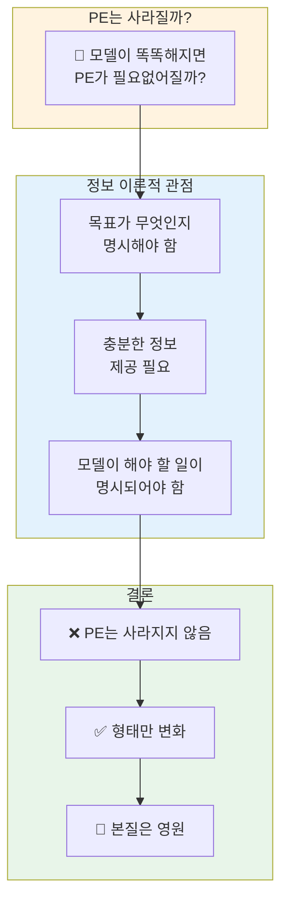
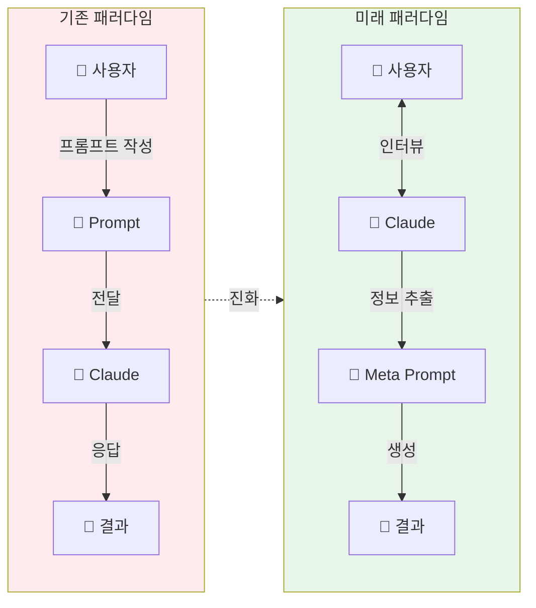
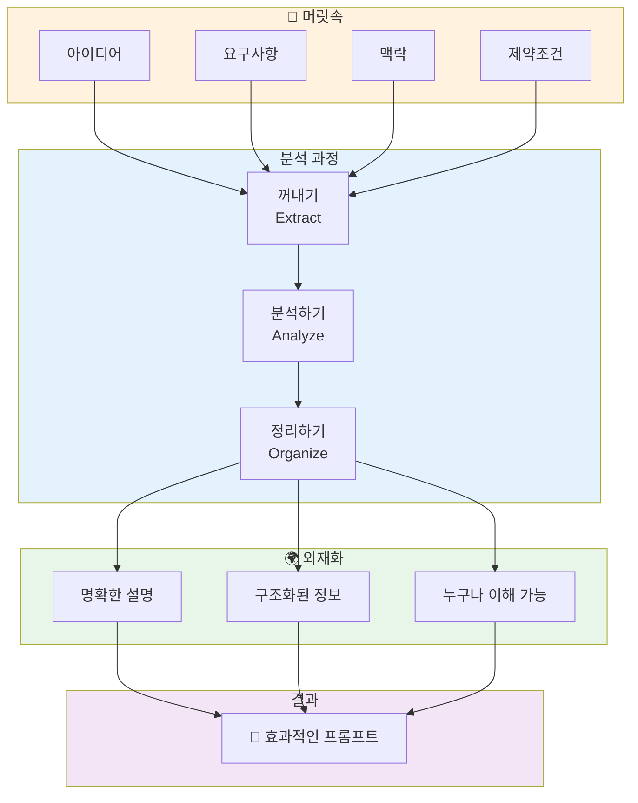

# 나노바나나 치트시트 프롬프트: AI Prompt Engineering Deep Dive - Future of Prompt Engineering

## 콘텐츠 정보

- **원본**: AI Prompt Engineering: A Deep Dive by Anthropic
- **챕터**: 11. Future of Prompt Engineering (프롬프트 엔지니어링의 미래)
- **유형**: 라운드테이블 토론 (Roundtable Discussion)
- **패널**: Alex Albert, David Hershey, Amanda Askell, Zack Witten
- **타임스탬프**: 64:34
- **영상 링크**: https://www.youtube.com/watch?v=T9aRN5JkmL8&t=3874s

---

## 프롬프트

다음 라운드테이블 토론 내용을 바탕으로 A4 한 장 분량의 학습 치트시트를 생성해주세요.

### 토론 내용

**제목**: AI Prompt Engineering Deep Dive - Chapter 11: Future of Prompt Engineering

**세션 개요**:
프롬프트 엔지니어링의 미래와 모델이 사용자를 인터뷰하는 방향으로의 전환을 예측합니다. 정보 이론적 관점에서 PE의 필요성을 분석하고, "뇌를 외재화하라"라는 궁극적인 프롬프팅 철학을 제시합니다.

**핵심 학습 내용**:

1. **프롬프트 엔지니어링은 사라질까?**
   - 정보 이론적 관점: 목표 명시는 항상 필요함
   - 모델이 아무리 똑똑해져도 "무엇을 원하는지" 전달은 필수
   - PE의 형태는 변하지만, 본질은 영원히 존재
   - 충분한 정보 제공 = PE의 핵심 (정보량 원칙)

2. **미래 방향: 모델이 인터뷰하는 시대**
   - 기존: 사용자가 프롬프트를 작성해서 전달
   - 미래: Claude가 사용자를 인터뷰하여 정보를 끌어냄
   - 이유: 가장 어려운 것은 머릿속에서 적절한 정보를 끌어내는 것
   - 메타 프롬프트: "나를 인터뷰해줘" 패턴 활용 증가

3. **관계의 진화: 파견직원에서 전문 디자이너로**
   - 과거: 파견 회사 직원 - 시키는 대로만 수행
   - 현재: 유능한 동료 - 협업하며 작업
   - 미래: 전문 디자이너 - 클라이언트를 인터뷰하며 요구사항 추출

4. **궁극의 인사이트: "뇌를 외재화하라"**
   - 머릿속에 있는 것들을 꺼내서
   - 완전히 이해한다고 느낄 만큼 충분히 분석하고
   - 거리에서 아무나 데려와도, 합리적인 사람이라면
   - 당신의 뇌를 그 사람에게 외재화할 수 있는 것
   - **이것이 프롬프팅의 핵심**

5. **핵심 인사이트**
   > "정보 이론적 관점에서 생각해보면, 원하는 것이 명시되도록 충분한 정보를 제공해야 합니다. 그게 프롬프트 엔지니어링이라면, 그건 항상 존재할 겁니다." - Amanda

   > "Claude에게 저를 인터뷰하게 하는 것을 훨씬 더 많이 시작했습니다. 가장 어려운 것은 실제로 내 머릿속에서 적절한 정보 세트를 끌어내는 것이기 때문입니다." - David

   > "뇌를 외재화하라. 이 대화를 마무리하기에 좋은 방법인 것 같네요." - 시리즈 마무리 멘트

### 치트시트 생성 지시사항

# Layout Structure (이 구조대로 배치해주세요)

**IMPORTANT**: 첨부된 이미지는 스타일(손필기 느낌, 모눈종이 배경, 아이콘)만 참조하세요. 레이아웃은 아래 지정된 구조를 따라 새로 만들어주세요.

```
┌─────────────────────────────────────────────────────────────────────┐
│  🍌 NANO BANANA CHEAT SHEET: FUTURE OF PROMPT ENGINEERING 🍌        │
│  (시리즈 피날레 - Chapter 11/11)                                     │
├─────────────────────────────────────────────────────────────────────┤
│  ┌─────────────────────────┐    ┌─────────────────────────────────┐│
│  │ 🎯 PE는 사라질까?        │    │ 🔮 미래 방향: 인터뷰 패러다임   ││
│  │                         │    │                                 ││
│  │  정보 이론적 관점:       │    │  기존: User → Prompt → Claude   ││
│  │  목표 명시는 항상 필요   │    │  미래: User ← Interview ← Claude││
│  │  → PE는 형태 변화, 본질 유지│    │  메타 프롬프트: "나를 인터뷰해줘"││
│  └─────────────────────────┘    └─────────────────────────────────┘│
├─────────────────────────────────────────────────────────────────────┤
│  ⚡ "뇌를 외재화하라" - THE ULTIMATE INSIGHT (이 섹션이 가장 넓어야 함!)│
│  ┌───────────────────────────────────────────────────────────────┐ │
│  │                                                               │ │
│  │  🧠 EXTERNALIZE YOUR BRAIN                                    │ │
│  │                                                               │ │
│  │  머릿속에 있는 것들을 꺼내서                                    │ │
│  │      ↓                                                        │ │
│  │  완전히 이해한다고 느낄 만큼 충분히 분석하고                      │ │
│  │      ↓                                                        │ │
│  │  거리에서 아무나 데려와도, 합리적인 사람이라면                    │ │
│  │      ↓                                                        │ │
│  │  당신의 뇌를 그 사람에게 외재화할 수 있는 것                      │ │
│  │      ↓                                                        │ │
│  │  "그게 프롬프팅의 핵심이에요"                                   │ │
│  │                                                               │ │
│  └───────────────────────────────────────────────────────────────┘ │
├─────────────────────────────────────────────────────────────────────┤
│  ┌───────────────────┐ ┌───────────────────┐ ┌───────────────────┐│
│  │ 🎤 인터뷰 기법     │ │ 🔄 관계의 진화    │ │ 📌 KEY TAKEAWAYS  ││
│  │                   │ │                   │ │                   ││
│  │ "Claude, 나를     │ │ 파견직원 →        │ │ PE = 영원히 존재   ││
│  │  인터뷰해줘"       │ │ 유능한 동료 →     │ │ 형태만 진화        ││
│  │ → 프롬프트로 변환  │ │ 전문 디자이너     │ │ 뇌를 외재화하라!   ││
│  └───────────────────┘ └───────────────────┘ └───────────────────┘│
└─────────────────────────────────────────────────────────────────────┘
```

## 배치 비율

| 영역 | 비율 | 내용 | 배치 |
|------|------|------|------|
| 상단 | 10% | 타이틀 + 시리즈 정보 | 전체 너비 |
| 중상단 | 20% | PE는 사라질까 + 미래 방향 | **좌우 2등분** |
| 중앙 | 45% | "뇌를 외재화하라" - 핵심 인사이트 | **가장 넓게!** |
| 하단 | 25% | 인터뷰 기법 + 관계의 진화 + Takeaways | **3등분** |

**2. 필수 시각 요소**

#### Mermaid 다이어그램 1: PE의 미래 - 정보 이론 관점



#### Mermaid 다이어그램 2: 프롬프팅 패러다임 전환



#### Mermaid 다이어그램 3: "뇌를 외재화하라" 프로세스



**3. PE의 미래 예측 테이블**

| 관점 | PE 사라질까? | 이유 | 변화 방향 |
|:---:|:---:|:---|:---|
| **정보 이론적** | ❌ No | 목표 명시는 항상 필요 | 정보 전달 방식 진화 |
| **실용적** | ❌ No | 머릿속 정보 추출 필요 | 인터뷰 기반으로 전환 |
| **형태적** | ✅ 변화 | 모델이 더 능동적으로 | 사용자 → 피인터뷰자 |
| **본질적** | ❌ No | 소통의 본질은 불변 | 협업 깊이 증가 |

**4. 관계의 진화 비교 테이블**

| 시기 | 관계 유형 | 특징 | 소통 방식 |
|:---:|:---:|:---|:---|
| **과거** | 파견 회사 직원 | 시키는 대로 수행 | 일방적 지시 |
| **현재** | 유능한 동료 | 협업하며 작업 | 상호 대화 |
| **미래** | 전문 디자이너 | 요구사항 능동 추출 | 클라이언트 인터뷰 |

**5. 인터뷰 기법 비교**

| Aspect | 기존 방식 | 인터뷰 방식 |
|:---:|:---:|:---:|
| **정보 흐름** | User → Claude | User ↔ Claude |
| **주도권** | 사용자 | 모델이 질문 주도 |
| **정보 추출** | 사용자가 미리 정리 | Claude가 끌어냄 |
| **난이도** | 높음 (정리 필요) | 낮음 (대답만 하면 됨) |
| **결과 품질** | 사용자 역량에 의존 | 모델이 보완 가능 |

**6. 강조 박스 (Callout)**

> **🧠 궁극의 인사이트: "뇌를 외재화하라"**
>
> "머릿속에 있는 것들을 꺼내서, 완전히 이해한다고 느낄 만큼 충분히 분석하고, 거리에서 아무나 데려와도, **합리적인 사람이라면**, 당신의 뇌를 그 사람에게 **외재화**할 수 있는 것. 그게 프롬프팅의 핵심인 것 같아요."
>
> "그게 제가 들어본 프롬프팅을 잘하는 방법에 대한 **최고의 요약**일 수도 있겠네요. 사실, 거의 확실히 그렇습니다."
>
> **"뇌를 외재화하라."**

> **정보 이론적 필연성**
>
> "정보 이론적 관점에서 생각해보면, **원하는 것이 명시되도록**, 모델이 해야 할 일이 명시되도록 **충분한 정보를 제공해야** 합니다. 그리고 그게 프롬프트 엔지니어링이라면, 그건 **항상 존재할** 거라고 생각합니다."
> - Amanda Askell

> **인터뷰 패턴의 부상**
>
> "저는 Claude에게 **저를 인터뷰하게 하는 것**을 훨씬 더 많이 시작했습니다. 가장 어려운 것은 실제로 **내 머릿속에서 적절한 정보 세트를 끌어내는 것**이기 때문입니다."
> - David Hershey

**7. 키워드 박스**

핵심 용어:
- **Externalize Your Brain (뇌를 외재화하라)**: 프롬프팅의 궁극적 본질 - 머릿속 정보를 합리적인 사람이 이해할 수 있도록 명확히 전달
- **Information Theory (정보 이론)**: PE의 필연성을 설명하는 관점 - 목표 명시를 위한 충분한 정보 제공은 항상 필요
- **Interview Pattern (인터뷰 패턴)**: 미래 PE 방향 - Claude가 사용자를 인터뷰하여 정보를 끌어내는 방식
- **Meta Prompt (메타 프롬프트)**: "나를 인터뷰해줘" 같은 프롬프트 생성을 위한 프롬프트
- **Relationship Evolution (관계 진화)**: 파견직원 → 유능한 동료 → 전문 디자이너로의 인간-AI 관계 변화
- **Reasonable Person Standard (합리적 사람 기준)**: 거리에서 아무나 데려와도 이해할 수 있을 정도의 명확성

**8. 시리즈 구조**

```
┌──────────────────────────────────────────────────────────────────┐
│  AI Prompt Engineering: A Deep Dive (전체 11개 챕터)              │
├──────────────────────────────────────────────────────────────────┤
│  1. Introduction - 소개                                          │
│  2. Defining Prompt Engineering - PE 정의                        │
│  3. What Makes a Good Prompt Engineer - 좋은 PE 조건              │
│  4. Refining Prompts - 프롬프트 다듬기                            │
│  5. Honesty, Personas & Metaphors - 정직함과 비유                 │
│  6. Model Reasoning - 모델 추론                                   │
│  7. Enterprise vs Research vs Chat - 세 가지 유형                 │
│  8. Tips to Improve - 향상 팁                                     │
│  9. Jailbreaking - 탈옥                                          │
│  10. Evolution of PE - PE의 진화                                  │
│  11. Future of PE - PE의 미래 ◀── 현재 챕터 (시리즈 피날레!)       │
└──────────────────────────────────────────────────────────────────┘
```

**9. 시리즈 마무리 섹션**

### 전체 시리즈 핵심 정리

| 챕터 | 주제 | 핵심 인사이트 |
|:---:|:---|:---|
| 1 | Introduction | PE의 중요성과 패널 소개 |
| 2 | Defining PE | 리셋 버튼 - 엔지니어링의 본질 |
| 3 | Good PE | 명확한 소통 + 호기심 |
| 4 | Refining | 반복 개선의 중요성 |
| 5 | Honesty | 솔직함과 비유의 힘 |
| 6 | Reasoning | 모델이 생각하는 방식 |
| 7 | Use Cases | Enterprise vs Research vs Chat |
| 8 | Tips | 실용적 향상 전략 |
| 9 | Jailbreaking | 보안과 윤리적 고려 |
| 10 | Evolution | PE의 발전 역사 |
| **11** | **Future** | **뇌를 외재화하라** |

### 시리즈 최종 교훈

```
┌─────────────────────────────────────────────────────────────────┐
│                                                                 │
│   "뇌를 외재화하라"                                              │
│                                                                 │
│   프롬프팅은 단순한 기술이 아닙니다.                               │
│   당신의 생각을 명확하게 전달하는 능력입니다.                        │
│                                                                 │
│   합리적인 사람이라면 누구나 이해할 수 있도록                        │
│   머릿속의 정보를 외부로 끄집어내는 것.                             │
│                                                                 │
│   이것이 프롬프트 엔지니어링의 본질이자,                            │
│   앞으로도 변하지 않을 핵심입니다.                                  │
│                                                                 │
│   - Anthropic Prompt Engineering Team                           │
│                                                                 │
└─────────────────────────────────────────────────────────────────┘
```

### 스타일 가이드

- **색상 테마**: 금색/보라색 계열 (피날레/결론 느낌)
- **폰트**: 깔끔한 산세리프
- **아이콘**: 뇌, 인터뷰 마이크, 미래 화살표, 변환 기호
- **강조**: "뇌를 외재화하라"를 가장 눈에 띄게
- **분위기**: 시리즈 마무리의 웅장함 + 실용적 교훈

### 추가 요청사항

1. 16:9 가로형 (Landscape) 레이아웃
2. "뇌를 외재화하라" 인사이트를 가장 크고 눈에 띄게 배치
3. 하단에 **"FINALE - 챕터 11/11"** 강조 표시
4. 시리즈 전체를 아우르는 마무리 느낌
5. 파견직원 → 전문 디자이너 진화를 시각적으로 표현

---

## 메타 정보

- **생성일**: 2026-01-11
- **원본 파일**: `docs/week1/ai-prompt-engineering-deep-dive/kr/future-of-prompt-engineering.md`
- **출력 형식**: 나노바나나 Pro 치트시트 프롬프트
- **시리즈 위치**: Chapter 11/11 (Final)

---

## 이미지 생성 요청

위의 구조와 내용을 바탕으로 **A4 한 장 분량의 치트시트 이미지**를 생성해주세요.

**이미지 스타일 요구사항:**
- 보기 좋게 정리된 **실제 펜 노트필기** 같은 느낌
- 용어 및 고유명사는 **영어 원문** 유지
- 설명 및 필기 내용은 **한국어**로 작성
- Mermaid 다이어그램은 **시각적 도식**으로 변환
- 표는 깔끔한 **테이블 형식**으로 렌더링
- **색상 강조**로 핵심 개념 구분
- **시리즈 피날레** 느낌을 살려 특별하게

**가로세로 비율**: 16:9 가로형 (Landscape orientation)
