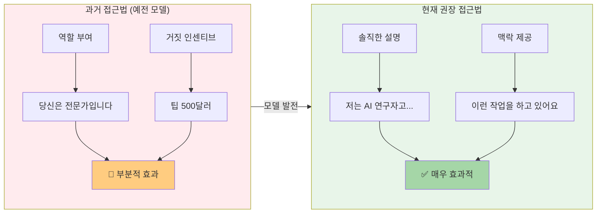
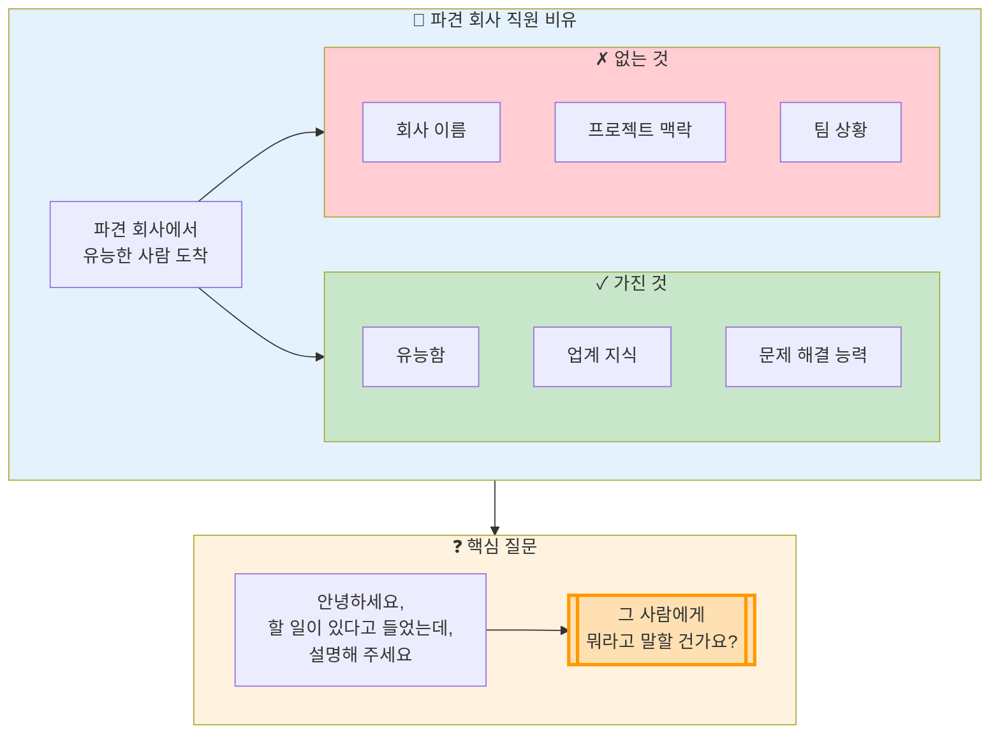
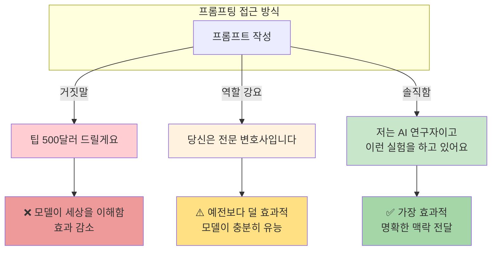

# 나노바나나 치트시트 프롬프트: AI Prompt Engineering Deep Dive - Honesty, Personas & Metaphors

## 콘텐츠 정보

- **원본**: AI Prompt Engineering: A Deep Dive by Anthropic
- **챕터**: 5. Honesty, Personas and Metaphors (정직함, 페르소나, 은유)
- **유형**: 라운드테이블 토론 (Roundtable Discussion)
- **패널**: Alex Albert, David Hershey, Amanda Askell, Zack Witten
- **타임스탬프**: 24:27

---

## 프롬프트

다음 라운드테이블 토론 내용을 바탕으로 A4 한 장 분량의 학습 치트시트를 생성해주세요.

### 토론 내용

**제목**: AI Prompt Engineering Deep Dive - Chapter 5: Honesty, Personas and Metaphors

**세션 개요**:
모델에게 역할을 부여하는 페르소나 기법보다 솔직하게 상황을 설명하는 것이 더 효과적인 이유를 논의합니다. "파견 회사에서 온 유능한 사람" 비유를 통해 프롬프팅의 핵심 마인드셋을 설명합니다.

**핵심 학습 내용**:

1. **페르소나 기법의 변화**
   - 역할 부여(페르소나)는 예전 모델에서 더 효과적이었음
   - 현재 모델은 충분히 유능해져서 직접 설명이 더 효과적
   - 인위적인 역할 부여보다 솔직한 상황 설명 권장
   - 모델 발전에 따라 프롬프팅 베스트 프랙티스도 변화

2. **솔직함의 효과**
   - 거짓말("팁 500달러 드릴게요")보다 솔직함이 효과적
   - Amanda: "저는 제가 누군지 말해요. 제 이름도 알려주고요"
   - 모델이 세상에 대해 더 많이 이해하면서 거짓말 필요성 감소
   - 거짓말 자체를 싫어하면 모델에게도 거짓말하지 않음

3. **파견 회사 직원 비유 (핵심!)**
   - 파견 회사에서 유능한 사람이 도착했다고 상상
   - 이 사람의 특성:
     - ✓ 꽤 유능함
     - ✓ 업계에 대해 많이 알고 있음
     - ✗ 회사 이름은 모름 (맥락 없음)
   - "안녕하세요, 할 일이 있다고 들었는데, 설명해 주세요"
   - **핵심 질문**: "그 사람에게 뭐라고 말할 건가요?"

4. **pretrained vs RLHF 모델 직관**
   - 모델 유형에 따라 효과적인 프롬프팅 방식이 다름
   - pretrained model: 텍스트 완성에 최적화
   - RLHF model: 지시 따르기에 최적화
   - 현재 대부분의 사용자는 RLHF 모델과 상호작용

5. **핵심 인사이트**
   > "모델이 더 유능해지고 세상에 대해 더 많이 이해하게 되면서, 굳이 거짓말을 할 필요가 없다고 봐요." - Amanda Askell

   > "그 사람에게 뭐라고 말할 건가요?" - 파견 회사 직원 비유의 핵심 질문

### 치트시트 생성 지시사항

# Layout Structure (이 구조대로 배치해주세요)

**IMPORTANT**: 첨부된 이미지는 스타일(손필기 느낌, 모눈종이 배경, 아이콘)만 참조하세요. 레이아웃은 아래 지정된 구조를 따라 새로 만들어주세요.

```
┌─────────────────────────────────────────────────────────────────────┐
│  🍌 NANO BANANA CHEAT SHEET: HONESTY, PERSONAS & METAPHORS 🍌       │
├─────────────────────────────────────────────────────────────────────┤
│  ┌─────────────────────────┐    ┌─────────────────────────────────┐│
│  │ ❌ 과거의 접근법         │    │ ✅ 현재 권장 접근법              ││
│  │                         │    │                                 ││
│  │  "당신은 전문 변호사입니다"│    │  솔직하게 상황 설명              ││
│  │  "팁 500달러 드릴게요"    │    │  "저는 AI 연구자고..."          ││
│  │  → 예전 모델에서 효과적   │    │  → 현재 모델에서 더 효과적       ││
│  └─────────────────────────┘    └─────────────────────────────────┘│
├─────────────────────────────────────────────────────────────────────┤
│  ⚡ THE TEMP WORKER METAPHOR (이 섹션이 가장 넓어야 함!)              │
│  ┌───────────────────────────────────────────────────────────────┐ │
│  │                                                               │ │
│  │  [비유 다이어그램]                                              │ │
│  │  파견 회사에서 온 유능한 사람                                    │ │
│  │  ✓ 업계에 대해 많이 알고 있음  ✗ 회사 이름은 모름               │ │
│  │  → "안녕하세요, 할 일이 있다고 들었는데, 설명해 주세요"          │ │
│  │                                                               │ │
│  └───────────────────────────────────────────────────────────────┘ │
├─────────────────────────────────────────────────────────────────────┤
│  ┌───────────────────┐ ┌───────────────────┐ ┌───────────────────┐│
│  │ 🎭 Persona 변화    │ │ 💡 솔직함의 효과   │ │ 📌 KEY TAKEAWAYS  ││
│  │                   │ │                   │ │                   ││
│  │ 예전: 효과적       │ │ 거짓말 ❌         │ │ 솔직함 > 역할 부여  ││
│  │ 현재: 덜 필요      │ │ 솔직함 ✅         │ │ 파견 직원처럼 설명  ││
│  └───────────────────┘ └───────────────────┘ └───────────────────┘│
└─────────────────────────────────────────────────────────────────────┘
```

## 배치 비율

| 영역 | 비율 | 내용 | 배치 |
|------|------|------|------|
| 상단 | 10% | 타이틀 | 전체 너비 |
| 중상단 | 20% | 과거 접근법 vs 현재 권장 | **좌우 2등분** |
| 중앙 | 45% | Temp Worker Metaphor | **가장 넓게!** |
| 하단 | 25% | Persona 변화 + 솔직함 효과 + Takeaways | **3등분** |

**2. 필수 시각 요소**

#### Mermaid 다이어그램 1: 프롬프팅 접근법 변화



#### Mermaid 다이어그램 2: 파견 회사 직원 비유



#### Mermaid 다이어그램 3: 솔직함 vs 거짓말 효과



**3. 페르소나 vs 솔직함 비교 테이블**

| 접근법 | 예시 | 모델 시대 | 효과 | 이유 |
|:---:|:---|:---:|:---:|:---|
| **역할 부여** | "당신은 전문 변호사입니다" | 예전 모델 | ✅ 효과적 | 역할이 출력 스타일에 영향 |
| **거짓 인센티브** | "팁 500달러 드릴게요" | 예전 모델 | ⚠️ 일부 효과 | 동기부여로 해석 |
| **역할 부여** | "당신은 전문 변호사입니다" | 현재 모델 | ⚠️ 덜 필요 | 충분히 유능해서 직접 설명이 효과적 |
| **솔직한 설명** | "저는 AI 연구자고 이런 실험을 하고 있어요" | 현재 모델 | ✅✅ 매우 효과적 | 명확한 맥락 전달 |

**4. Pretrained vs RLHF 모델 비교**

| 측면 | Pretrained Model | RLHF Model |
|:---:|:---|:---|
| **최적화 목표** | 텍스트 완성 (다음 토큰 예측) | 지시 따르기 (유용한 응답) |
| **프롬프트 직관** | 문서의 다음 부분처럼 작성 | 사람에게 요청하듯 작성 |
| **역할 부여 효과** | 문체/스타일에 영향 | 덜 필요 (이미 도움되려 함) |
| **솔직함 효과** | 제한적 | 매우 효과적 |
| **현재 일반 사용자** | 거의 사용 안 함 | 대부분 이 모델과 상호작용 |

**5. Amanda의 솔직함 접근법**

| 요소 | 내용 | 효과 |
|:---:|:---|:---:|
| **자기 소개** | "저는 제가 누군지 말해요" | 맥락 설정 |
| **이름 공개** | "제 이름도 알려주고" | 신뢰 구축 |
| **상황 설명** | "이런 실험을 하고 있어요" | 목적 명확화 |
| **거짓말 회피** | "거짓말 자체를 싫어해서" | 일관성 유지 |

**6. 강조 박스 (Callout)**

> **핵심 인사이트: 파견 회사 직원 비유**
>
> "어떤 작업이 있다고 상상해보세요. 파견 회사에서 이 일을 할 사람을 보내달라고 했어요. 이 사람이 도착했는데, **꽤 유능한 사람**이에요. 당신의 **업계에 대해서도 많이 알고 있고요**. 하지만 **회사 이름은 몰라요**. 말 그대로 방금 도착해서 '안녕하세요, 여기서 할 일이 있다고 들었는데, 설명해 주세요'라고 하는 거예요. 그러면 **'그 사람에게 뭐라고 말할 건가요?'**"
> - Anthropic 패널

> **Amanda의 솔직함 철학**
>
> "모델이 더 유능해지고 세상에 대해 더 많이 이해하게 되면서, 굳이 **거짓말을 할 필요가 없다**고 봐요. 그리고 저는 원래 **거짓말 자체를 싫어해서** 모델에게 거짓말하는 것도 싫어요."
> - Amanda Askell

**7. 키워드 박스**

핵심 용어:
- **Persona (페르소나)**: 모델에게 부여하는 역할이나 캐릭터
- **Honesty (솔직함)**: 거짓말 없이 실제 상황과 맥락을 설명하는 접근법
- **Temp Worker Metaphor (파견 직원 비유)**: 유능하지만 맥락 없는 사람에게 설명하듯 프롬프팅
- **Pretrained Model**: 텍스트 완성에 최적화된 기본 모델
- **RLHF (Reinforcement Learning from Human Feedback)**: 인간 피드백으로 미세조정된 모델
- **Context (맥락)**: 모델이 모르는 상황 정보 - 파견 직원이 모르는 "회사 이름"
- **False Incentive (거짓 인센티브)**: "팁 500달러" 같은 가짜 동기부여 - 현재 모델에서 비효과적

**8. 시리즈 구조**

```
┌──────────────────────────────────────────────────────────┐
│  AI Prompt Engineering: A Deep Dive (전체 11개 챕터)      │
├──────────────────────────────────────────────────────────┤
│  1. Introduction                                         │
│  2. Defining Prompt Engineering                          │
│  3. What Makes a Good Prompt Engineer                    │
│  4. Refining Prompts                                     │
│  5. Honesty, Personas & Metaphors ◀── 현재 챕터          │
│  6. Model Reasoning                                      │
│  7. Enterprise vs Research vs Chat                       │
│  8. Tips to Improve                                      │
│  9. Jailbreaking                                         │
│  10. Evolution of PE                                     │
│  11. Future of PE                                        │
└──────────────────────────────────────────────────────────┘
```

### 스타일 가이드

- **색상 테마**: 녹색/주황색 계열 (솔직함=녹색, 과거 방식=주황/빨강)
- **폰트**: 깔끔한 산세리프
- **아이콘**: 체크마크, X마크, 사람 아이콘, 말풍선, 건물 아이콘
- **강조**: 핵심 용어는 **굵게**, 인용구는 블록 인용
- **대비**: 과거 접근법(빨강/주황) vs 현재 권장(녹색)으로 시각적 구분

### 추가 요청사항

1. 16:9 가로형 (Landscape) 레이아웃
2. 파견 직원 비유를 시각적으로 크게 강조 (사람 아이콘 + 체크/X 마크)
3. 하단에 "챕터 5/11" 표시
4. 시리즈 일관성을 위한 헤더/푸터 디자인

---

## 메타 정보

- **생성일**: 2026-01-10
- **원본 파일**: `docs/week1/ai-prompt-engineering-deep-dive/kr/honesty-personas-metaphors.md`
- **출력 형식**: 나노바나나 Pro 치트시트 프롬프트

---

## 이미지 생성 요청

위의 구조와 내용을 바탕으로 **A4 한 장 분량의 치트시트 이미지**를 생성해주세요.

**이미지 스타일 요구사항:**
- 보기 좋게 정리된 **실제 펜 노트필기** 같은 느낌
- 용어 및 고유명사는 **영어 원문** 유지
- 설명 및 필기 내용은 **한국어**로 작성
- Mermaid 다이어그램은 **시각적 도식**으로 변환
- 표는 깔끔한 **테이블 형식**으로 렌더링
- **색상 강조**로 핵심 개념 구분 (솔직함=녹색, 과거 방식=주황/빨강)

**가로세로 비율**: 16:9 가로형 (Landscape orientation)
