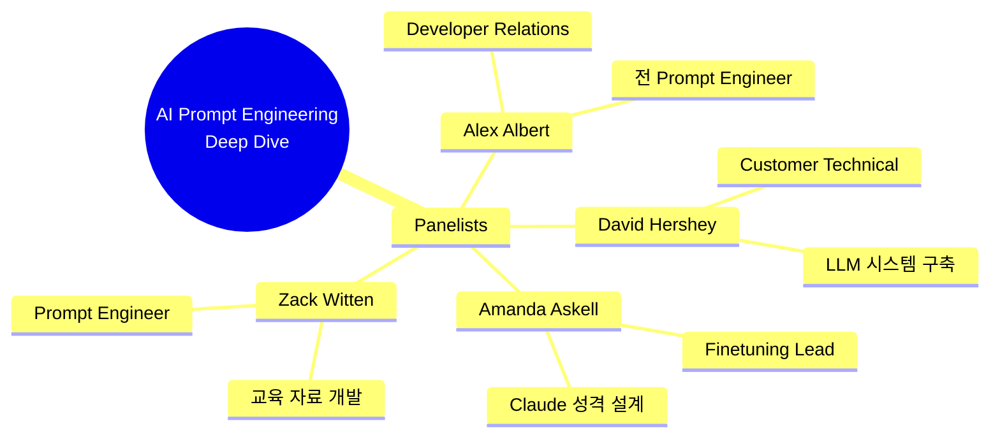
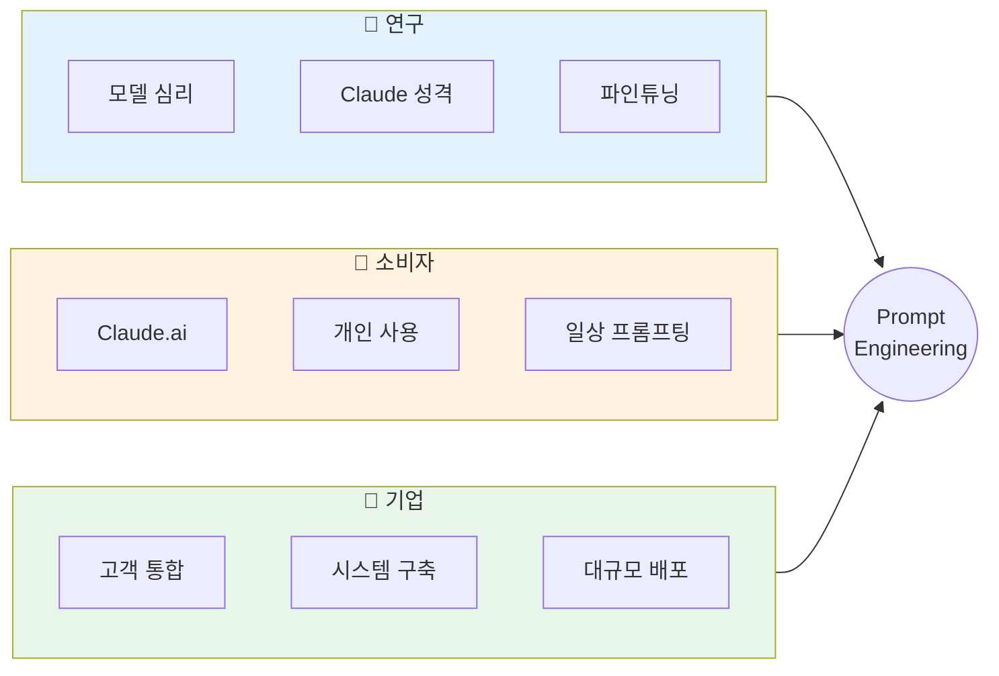

# 나노바나나 치트시트 프롬프트: AI Prompt Engineering Deep Dive - Introduction

## 콘텐츠 정보

- **원본**: AI Prompt Engineering: A Deep Dive by Anthropic
- **챕터**: 1. Introduction (소개)
- **유형**: 라운드테이블 토론 (Roundtable Discussion)
- **패널**: Alex Albert, David Hershey, Amanda Askell, Zack Witten

---

## 프롬프트

다음 라운드테이블 토론 내용을 바탕으로 A4 한 장 분량의 학습 치트시트를 생성해주세요.

### 토론 내용

**제목**: AI Prompt Engineering Deep Dive - Chapter 1: Introduction

**세션 개요**:
Anthropic의 프롬프트 엔지니어링 전문가 4명이 연구, 소비자, 기업 관점에서 프롬프트 엔지니어링에 대해 심층 토론합니다. 다양한 배경을 가진 전문가들이 각자의 경험과 인사이트를 공유합니다.

**핵심 학습 내용**:

1. **패널리스트 소개 및 전문 분야**
   - **Alex Albert**: Developer Relations 리드, 전 프롬프트 엔지니어
     - 솔루션 아키텍트부터 연구까지 다양한 경험
   - **David Hershey**: 고객 기술 지원 전문
     - 파인튜닝 지원 및 LLM 시스템 구축
   - **Amanda Askell**: 파인튜닝 팀 리드
     - Claude의 정직함과 친절함 설계 담당
   - **Zack Witten**: 프롬프트 엔지니어
     - 프롬프트 생성기, 교육 자료 개발

2. **세 가지 관점의 통합**
   - **연구(Research)**: 모델 심리 이해, Claude의 성격 설계
   - **소비자(Consumer)**: 일반 사용자 경험, Claude.ai
   - **기업(Enterprise)**: 고객 통합, 시스템 구축, 대규모 배포

3. **토론 형식의 특징**
   - 다양한 의견을 폭넓게 공유
   - 자유로운 토론을 통한 PE 탐구
   - 실무 경험 기반의 인사이트

4. **핵심 인사이트**
   > "프롬프트 엔지니어링이 실제로 무엇인지, 어떤 의미가 있는지 탐구해보겠습니다"

   > "누가 첫 번째 프롬프트 엔지니어인지 항상 논쟁해요" - Alex와 Zack의 우호적 경쟁

### 치트시트 생성 지시사항

# Layout Structure (이 구조대로 배치해주세요)

**IMPORTANT**: 첨부된 이미지는 스타일(손필기 느낌, 모눈종이 배경, 아이콘)만 참조하세요. 레이아웃은 아래 지정된 구조를 따라 새로 만들어주세요.

```
┌─────────────────────────────────────────────────────────────────────┐
│  🍌 NANO BANANA CHEAT SHEET: PROMPT ENGINEERING - INTRODUCTION 🍌   │
├─────────────────────────────────────────────────────────────────────┤
│  ┌─────────────────────────┐    ┌─────────────────────────────────┐│
│  │ 🎯 이 세션의 목적        │    │ 🎙️ ROUNDTABLE FORMAT            ││
│  │                         │    │                                 ││
│  │  Anthropic 전문가 4인의  │    │  연구 × 소비자 × 기업 관점       ││
│  │  PE Deep Dive 라운드테이블│    │  다양한 의견 공유 + 자유 토론    ││
│  │                         │    │                                 ││
│  └─────────────────────────┘    └─────────────────────────────────┘│
├─────────────────────────────────────────────────────────────────────┤
│  👥 PANELISTS OVERVIEW (이 섹션이 가장 넓어야 함!)                   │
│  ┌───────────────────────────────────────────────────────────────┐ │
│  │                                                               │ │
│  │  ┌─────────────┐ ┌─────────────┐ ┌─────────────┐ ┌──────────┐│ │
│  │  │ 🎤 Alex     │ │ 🤝 David    │ │ 🧪 Amanda   │ │ ⚡ Zack  ││ │
│  │  │ DevRel Lead │ │ Customer    │ │ Finetuning  │ │ Prompt   ││ │
│  │  │ 전 PE       │ │ Technical   │ │ Team Lead   │ │ Engineer ││ │
│  │  │             │ │             │ │ Claude 성격  │ │ 교육자료  ││ │
│  │  └─────────────┘ └─────────────┘ └─────────────┘ └──────────┘│ │
│  │                                                               │ │
│  └───────────────────────────────────────────────────────────────┘ │
├─────────────────────────────────────────────────────────────────────┤
│  ┌───────────────────┐ ┌───────────────────┐ ┌───────────────────┐│
│  │ 🔬 RESEARCH       │ │ 👤 CONSUMER       │ │ 🏢 ENTERPRISE     ││
│  │                   │ │                   │ │                   ││
│  │ 모델 심리 이해     │ │ 일반 사용자 경험   │ │ 고객 통합         ││
│  │ Claude 성격 설계   │ │ Claude.ai         │ │ 시스템 구축       ││
│  │ 파인튜닝 연구      │ │ 개인 프롬프팅     │ │ 대규모 배포       ││
│  └───────────────────┘ └───────────────────┘ └───────────────────┘│
└─────────────────────────────────────────────────────────────────────┘
```

## 배치 비율

| 영역 | 비율 | 내용 | 배치 |
|------|------|------|------|
| 상단 | 10% | 타이틀 | 전체 너비 |
| 중상단 | 20% | 세션 목적 + Roundtable Format | **좌우 2등분** |
| 중앙 | 45% | Panelists Overview (4인 카드) | **가장 넓게!** |
| 하단 | 25% | Research + Consumer + Enterprise | **3등분** |

**2. 필수 시각 요소**

#### Mermaid 다이어그램 1: 패널리스트 전문 분야



#### Mermaid 다이어그램 2: 세 가지 관점



**3. 패널리스트 프로필 테이블**

| 이름 | 역할 | 전문 분야 | 핵심 기여 |
|:---|:---|:---|:---|
| **Alex Albert** | Developer Relations Lead | Solutions + Research | PE 실무와 연구 경험의 가교 |
| **David Hershey** | Customer Technical | Finetuning + Systems | 고객과 함께 LLM 시스템 구축 |
| **Amanda Askell** | Finetuning Team Lead | Claude Character | Claude의 정직함과 친절함 설계 |
| **Zack Witten** | Prompt Engineer | Education + Tools | 프롬프트 생성기, 교육 자료 개발 |

**4. 세 가지 관점 비교 테이블**

| 관점 | 초점 | 주요 관심사 | 대표 패널 |
|:---:|:---|:---|:---|
| **Research** | 모델 동작 원리 | 심리학적 접근, Claude 성격 | Amanda |
| **Consumer** | 사용자 경험 | Claude.ai, 개인 프롬프팅 | Zack |
| **Enterprise** | 비즈니스 통합 | 시스템 구축, 대규모 배포 | David |

**5. 강조 박스 (Callout)**

> **세션 목표**
>
> "프롬프트 엔지니어링이 **실제로 무엇인지**, 어떤 **의미가 있는지** 탐구해보겠습니다"
> - 다양한 관점에서의 폭넓은 견해 공유
> - 자유로운 토론을 통한 깊은 이해

> **재미있는 에피소드**
>
> Alex와 Zack의 "첫 번째 프롬프트 엔지니어" 논쟁
> - Alex: "내가 먼저"
> - Zack: "아니, 내가 먼저"
> → 우호적 경쟁 관계 속에서 발전

**6. 키워드 박스**

핵심 용어:
- **Prompt Engineering (PE)**: 프롬프트 엔지니어링 - 모델과 효과적으로 소통하는 기술
- **Developer Relations**: 개발자 관계 - 개발자 커뮤니티와 소통하는 역할
- **Finetuning**: 파인튜닝 - 사전학습된 모델을 특정 목적에 맞게 조정
- **Claude Character**: Claude 성격 - 모델의 행동 특성과 가치관
- **Roundtable**: 라운드테이블 - 전문가들의 자유 토론 형식

**7. 시리즈 구조**

```
┌──────────────────────────────────────────────────────────┐
│  AI Prompt Engineering: A Deep Dive (전체 11개 챕터)      │
├──────────────────────────────────────────────────────────┤
│  1. Introduction ◀── 현재 챕터                           │
│  2. Defining Prompt Engineering                          │
│  3. What Makes a Good Prompt Engineer                    │
│  4. Refining Prompts                                     │
│  5. Honesty, Personas & Metaphors                        │
│  6. Model Reasoning                                      │
│  7. Enterprise vs Research vs Chat                       │
│  8. Tips to Improve                                      │
│  9. Jailbreaking                                         │
│  10. Evolution of PE                                     │
│  11. Future of PE                                        │
└──────────────────────────────────────────────────────────┘
```

### 스타일 가이드

- **색상 테마**: Anthropic 브랜드 컬러 (주황/산호색 계열)
- **폰트**: 깔끔한 산세리프
- **아이콘**: 마이크, 사람, 건물, 플라스크 등 역할별 아이콘
- **강조**: 핵심 용어는 **굵게**, 인용구는 `블록 인용`

### 추가 요청사항

1. 16:9 가로형 (Landscape) 레이아웃
2. 4명의 패널리스트를 시각적으로 구분하는 카드 디자인
3. 하단에 "챕터 1/11" 표시
4. 시리즈 일관성을 위한 헤더/푸터 디자인

---

## 메타 정보

- **생성일**: 2026-01-10
- **원본 파일**: `docs/week1/ai-prompt-engineering-deep-dive/kr/introduction.md`
- **출력 형식**: 나노바나나 Pro 치트시트 프롬프트

---

## 이미지 생성 요청

위의 구조와 내용을 바탕으로 **A4 한 장 분량의 치트시트 이미지**를 생성해주세요.

**이미지 스타일 요구사항:**
- 보기 좋게 정리된 **실제 펜 노트필기** 같은 느낌
- 용어 및 고유명사는 **영어 원문** 유지
- 설명 및 필기 내용은 **한국어**로 작성
- Mermaid 다이어그램은 **시각적 도식**으로 변환
- 표는 깔끔한 **테이블 형식**으로 렌더링
- **색상 강조**로 핵심 개념 구분

**가로세로 비율**: 16:9 가로형 (Landscape orientation)
