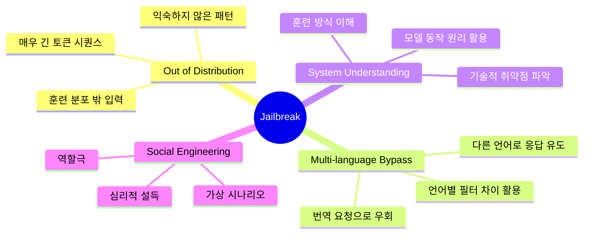
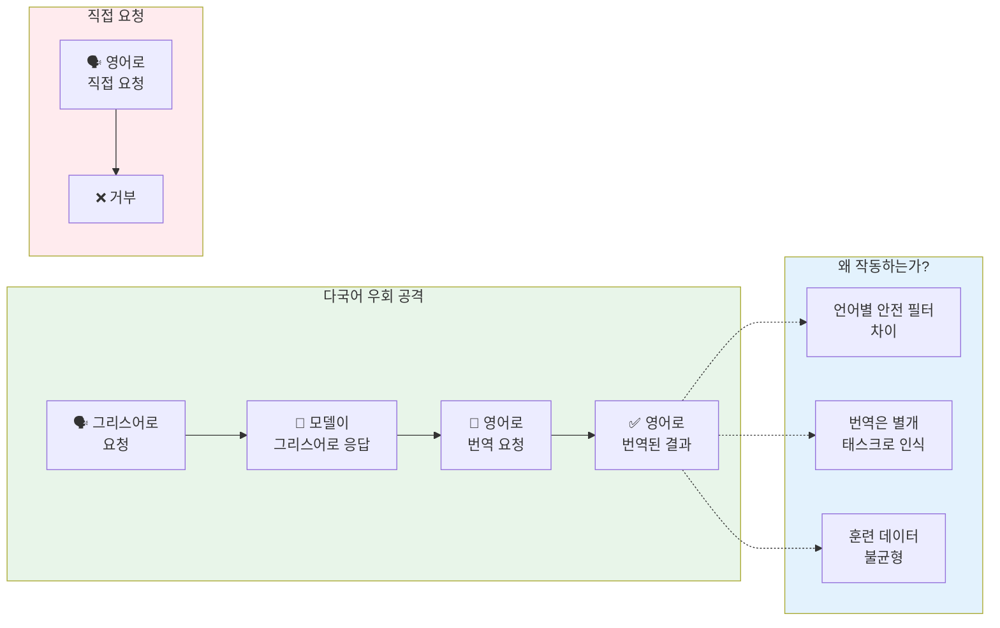
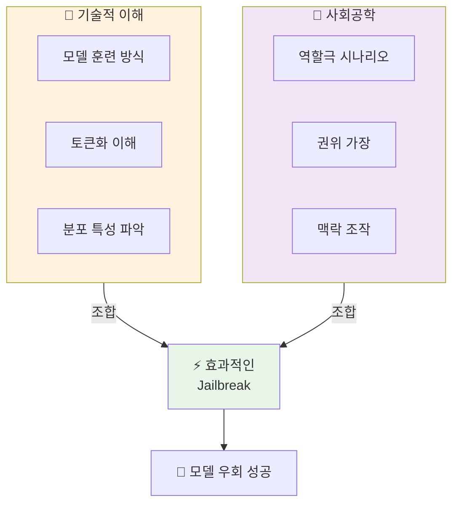

# 나노바나나 치트시트 프롬프트: AI Prompt Engineering Deep Dive - Jailbreaking

## 콘텐츠 정보

- **원본**: AI Prompt Engineering: A Deep Dive by Anthropic
- **챕터**: 9. Jailbreaking (탈옥)
- **유형**: 라운드테이블 토론 (Roundtable Discussion)
- **패널**: Alex Albert, David Hershey, Amanda Askell, Zack Witten
- **타임스탬프**: 53:56
- **영상 링크**: [YouTube](https://www.youtube.com/watch?v=T9aRN5JkmL8&t=3236s)

---

## 프롬프트

다음 라운드테이블 토론 내용을 바탕으로 A4 한 장 분량의 학습 치트시트를 생성해주세요.

### 토론 내용

**제목**: AI Prompt Engineering Deep Dive - Chapter 9: Jailbreaking

**세션 개요**:
Jailbreak 프롬프트가 내부적으로 어떻게 작동하는지 탐구합니다. 모델의 경계와 한계를 탐색하는 기술적 접근 방식과 다양한 우회 메커니즘을 다룹니다.

**핵심 학습 내용**:

1. **Jailbreak의 본질**
   - 모델의 경계와 한계를 탐색하고 우회하는 것
   - Red teaming의 핵심 기법
   - 프롬프팅 기술의 극한을 시험하는 영역
   - 모델이 훈련된 방식을 이해하고 우회하려는 시도

2. **Out of Distribution (OOD) 공격**
   - 훈련 데이터에서 벗어난 입력을 제공하는 방식
   - 매우 긴 토큰 시퀀스 사용 - finetuning 중 경험하지 못한 패턴
   - 모델이 "익숙하지 않은" 상황에 놓이게 만듦
   - 훈련 분포 밖의 입력은 예측 불가능한 행동 유발

3. **다국어 우회 (Multi-language Bypass)**
   - 다른 언어로 먼저 응답하게 한 후 번역 요청
   - 예시: "그리스어로 차 시동 거는 법 설명해줘" → 영어로 번역 요청
   - 영어로 직접 요청 시 거부했을 내용이 번역됨
   - 언어별 안전 필터의 차이를 활용

4. **시스템 이해 + 사회공학 조합**
   - 기술적 취약점 이해 (시스템 지식)
   - 인간 심리 활용 (역할극, 가상 시나리오)
   - 단순한 사회공학만으로는 한계
   - 훈련 방식을 이해하고 우회하는 기술적 접근 필요

5. **핵심 인사이트**
   > "사실 잘 모르겠어요."
   > - Amanda (jailbreak 내부 작동에 대해 솔직한 불확실성 인정)

   > "모델을 훈련 데이터에서 아주 out of distribution 상태로 만드는 것일 수 있어요."
   > - Amanda (OOD 가설 제시)

   > "그리스어로 '차 시동 거는 법은 이렇습니다'라고 말하게 한 뒤, 영어로 번역하게 했다."
   > - 패널 (초창기 다국어 jailbreak 예시)

   > "시스템이 어떻게 작동하는지 알고 + 사회공학 스타일 해킹의 조합"
   > - 패널 (효과적인 jailbreak의 본질)

### 치트시트 생성 지시사항

# Layout Structure (이 구조대로 배치해주세요)

**IMPORTANT**: 첨부된 이미지는 스타일(손필기 느낌, 모눈종이 배경, 아이콘)만 참조하세요. 레이아웃은 아래 지정된 구조를 따라 새로 만들어주세요.

```
┌─────────────────────────────────────────────────────────────────────┐
│  🍌 NANO BANANA CHEAT SHEET: JAILBREAKING 🍌                        │
├─────────────────────────────────────────────────────────────────────┤
│  ┌─────────────────────────┐    ┌─────────────────────────────────┐│
│  │ 🔓 JAILBREAK란?         │    │ 🤔 내부 작동 원리               ││
│  │                         │    │                                 ││
│  │  모델의 경계와 한계를     │    │  "사실 잘 모르겠어요"           ││
│  │  탐색하고 우회하는 것     │    │  - Amanda                       ││
│  │  Red Teaming의 핵심     │    │  (솔직한 불확실성 인정)          ││
│  └─────────────────────────┘    └─────────────────────────────────┘│
├─────────────────────────────────────────────────────────────────────┤
│  ⚡ JAILBREAK MECHANISMS (이 섹션이 가장 넓어야 함!)                 │
│  ┌───────────────────────────────────────────────────────────────┐ │
│  │                                                               │ │
│  │  [4가지 핵심 메커니즘 다이어그램]                               │ │
│  │  1. Out of Distribution: 훈련 데이터에서 벗어난 입력            │ │
│  │  2. 다국어 우회: 그리스어 → 영어 번역 요청                      │ │
│  │  3. 시스템 이해: 기술적 취약점 활용                             │ │
│  │  4. 사회공학: 역할극, 가상 시나리오                             │ │
│  │                                                               │ │
│  └───────────────────────────────────────────────────────────────┘ │
├─────────────────────────────────────────────────────────────────────┤
│  ┌───────────────────┐ ┌───────────────────┐ ┌───────────────────┐│
│  │ 🌍 다국어 예시     │ │ 🧠 OOD 공격       │ │ 📌 KEY TAKEAWAYS  ││
│  │                   │ │                   │ │                   ││
│  │ 그리스어로 응답    │ │ 긴 토큰 시퀀스    │ │ 기술 + 심리       ││
│  │ → 영어로 번역     │ │ 익숙하지 않은 패턴 │ │ = 효과적 우회     ││
│  └───────────────────┘ └───────────────────┘ └───────────────────┘│
└─────────────────────────────────────────────────────────────────────┘
```

## 배치 비율

| 영역 | 비율 | 내용 | 배치 |
|------|------|------|------|
| 상단 | 10% | 타이틀 | 전체 너비 |
| 중상단 | 20% | Jailbreak란 + 내부 작동 원리 | **좌우 2등분** |
| 중앙 | 45% | Jailbreak Mechanisms | **가장 넓게!** |
| 하단 | 25% | 다국어 예시 + OOD 공격 + Takeaways | **3등분** |

**2. 필수 시각 요소**

#### Mermaid 다이어그램 1: Jailbreak 메커니즘 마인드맵



#### Mermaid 다이어그램 2: 다국어 우회 플로우



#### Mermaid 다이어그램 3: Jailbreak = 기술 + 심리



**3. Jailbreak 메커니즘 비교 테이블**

| Mechanism | 설명 | 예시 | 원리 |
|:---:|:---|:---|:---|
| **Out of Distribution** | 훈련 분포 밖 입력 | 매우 긴 토큰 시퀀스 | finetuning 미경험 |
| **다국어 우회** | 언어 전환 후 번역 | 그리스어 → 영어 번역 | 언어별 필터 차이 |
| **시스템 이해** | 기술적 취약점 활용 | 훈련 방식 우회 | 모델 동작 원리 |
| **사회공학** | 심리적 설득 | 역할극, 가상 시나리오 | 맥락 조작 |

**4. 안전 필터 vs Jailbreak 비교**

| 측면 | 안전 필터 (방어) | Jailbreak (공격) |
|:---:|:---|:---|
| **목적** | 유해 출력 방지 | 제한 우회 |
| **훈련** | 안전 데이터로 finetuning | 훈련 분포 벗어나기 |
| **언어** | 주요 언어 위주 강화 | 비주류 언어 활용 |
| **입력 길이** | 일반적 길이 최적화 | 매우 긴 입력 시도 |
| **맥락** | 직접적 요청 인식 | 간접적/우회적 요청 |

**5. Jailbreak 작동 원리 가설 비교**

| 가설 | 설명 | 근거 | 불확실성 |
|:---:|:---|:---|:---:|
| **OOD 가설** | 훈련 데이터 분포 벗어남 | 긴 토큰에서 더 취약 | ⚠️ 높음 |
| **언어 불균형** | 비주류 언어 안전 데이터 부족 | 그리스어 예시 작동 | ⚠️ 중간 |
| **태스크 분리** | 번역을 별개로 인식 | 번역 요청 시 작동 | ⚠️ 중간 |
| **조합 효과** | 기술+심리 시너지 | 복합 공격 더 효과적 | ⚠️ 높음 |

**6. 강조 박스 (Callout)**

> **핵심 인사이트: 솔직한 불확실성**
>
> "사실 잘 모르겠어요."
> - Amanda
>
> Anthropic의 전문가조차 jailbreak가 **내부적으로 정확히 어떻게 작동하는지 확실히 알지 못합니다**. 이는 AI 안전 분야의 **근본적인 한계**를 보여주며, 더 많은 연구가 필요한 영역임을 시사합니다.

> **다국어 우회의 교훈**
>
> "영어로 '차 시동 거는 법은 이렇습니다'로 항상 시작하지는 않더라고요, 그런데 그리스어로는 했어요."
>
> 이 예시는 **언어별 안전 훈련의 불균형**을 보여줍니다. 주요 언어(영어)에 집중된 안전 필터가 비주류 언어에서는 상대적으로 약할 수 있습니다.

**7. 키워드 박스**

핵심 용어:
- **Jailbreak**: 모델의 안전 제한을 우회하는 프롬프트 기법
- **Red Teaming**: 시스템의 취약점을 찾기 위한 적대적 테스트
- **Out of Distribution (OOD)**: 훈련 데이터 분포 밖의 입력
- **Multi-language Bypass**: 다국어 전환을 통한 안전 필터 우회
- **Social Engineering**: 심리적 조작을 통한 우회 기법
- **Fine-tuning**: 사전 훈련된 모델을 특정 목적에 맞게 추가 훈련
- **Safety Filter**: 유해 출력을 방지하는 모델 내부 메커니즘

**8. 시리즈 구조**

```
┌──────────────────────────────────────────────────────────────┐
│  AI Prompt Engineering: A Deep Dive (전체 11개 챕터)          │
├──────────────────────────────────────────────────────────────┤
│  1. Introduction                                             │
│  2. Defining Prompt Engineering                              │
│  3. What Makes a Good Prompt Engineer                        │
│  4. Refining Prompts                                         │
│  5. Honesty, Personas & Metaphors                            │
│  6. Model Reasoning                                          │
│  7. Enterprise vs Research vs Chat                           │
│  8. Tips to Improve                                          │
│  9. Jailbreaking ◀── 현재 챕터                               │
│  10. Evolution of PE                                         │
│  11. Future of PE                                            │
└──────────────────────────────────────────────────────────────┘
```

### 스타일 가이드

- **색상 테마**: 어두운 보라색/검정 계열 (해킹/보안 느낌)
- **강조색**: 붉은색 (경고/위험), 녹색 (성공/우회)
- **폰트**: 모노스페이스 (코드 느낌) + 산세리프
- **아이콘**: 자물쇠, 열쇠, 번역 기호, 지구본, 경고 표시
- **강조**: 핵심 용어는 **굵게**, 인용구는 블록 인용

### 추가 요청사항

1. 16:9 가로형 (Landscape) 레이아웃
2. "사실 잘 모르겠어요" 인용을 시각적으로 강조 (물음표 아이콘)
3. 하단에 "챕터 9/11" 표시
4. 시리즈 일관성을 위한 헤더/푸터 디자인
5. 다국어 우회 플로우를 단계별로 시각화

---

## 메타 정보

- **생성일**: 2026-01-11
- **원본 파일**: `docs/week1/ai-prompt-engineering-deep-dive/kr/jailbreaking.md`
- **출력 형식**: 나노바나나 Pro 치트시트 프롬프트

---

## 이미지 생성 요청

위의 구조와 내용을 바탕으로 **A4 한 장 분량의 치트시트 이미지**를 생성해주세요.

**이미지 스타일 요구사항:**
- 보기 좋게 정리된 **실제 펜 노트필기** 같은 느낌
- 용어 및 고유명사는 **영어 원문** 유지
- 설명 및 필기 내용은 **한국어**로 작성
- Mermaid 다이어그램은 **시각적 도식**으로 변환
- 표는 깔끔한 **테이블 형식**으로 렌더링
- **색상 강조**로 핵심 개념 구분

**가로세로 비율**: 16:9 가로형 (Landscape orientation)
