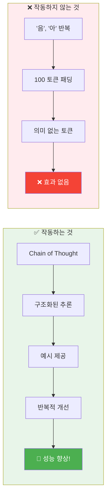
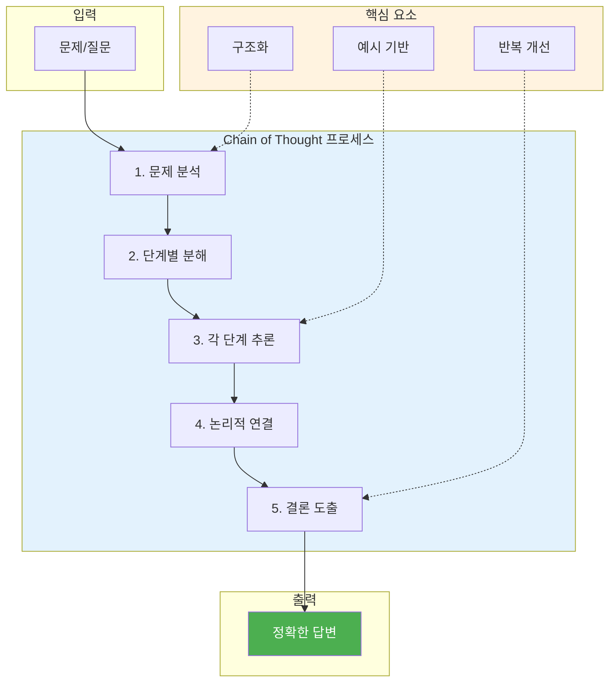
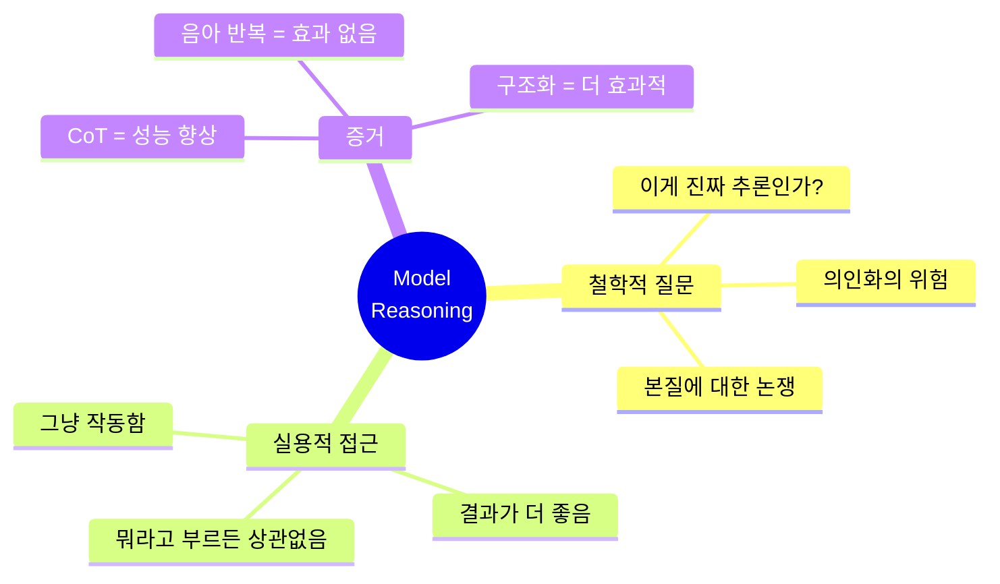

# 나노바나나 치트시트 프롬프트: AI Prompt Engineering Deep Dive - Model Reasoning

## 콘텐츠 정보

- **원본**: AI Prompt Engineering: A Deep Dive by Anthropic
- **챕터**: 6. Model Reasoning (모델의 추론)
- **유형**: 라운드테이블 토론 (Roundtable Discussion)
- **패널**: Alex Albert, David Hershey, Amanda Askell, Zack Witten
- **타임스탬프**: 37:12

---

## 프롬프트

다음 라운드테이블 토론 내용을 바탕으로 A4 한 장 분량의 학습 치트시트를 생성해주세요.

### 토론 내용

**제목**: AI Prompt Engineering Deep Dive - Chapter 6: Model Reasoning

**세션 개요**:
Chain of Thought(CoT)가 실제로 효과가 있는지, 단순한 계산 공간에 불과한지에 대해 토론합니다. 모델의 추론 과정이 "진짜 추론"인지에 대한 철학적 논의와 함께, 실용적 관점에서 어떻게 활용해야 하는지를 다룹니다.

**핵심 학습 내용**:

1. **Chain of Thought의 효과**
   - 모델이 답을 제공하기 전에 추론 과정을 설명하도록 하는 방법
   - **확실히 모델 성능을 개선함** - "그냥 작동합니다"
   - 구조화된 추론 + 예시 제공 = 더 큰 효과
   - 철학적으로 "진짜 추론"인지와 관계없이 실용적으로 작동

2. **"음아" 반복 실험 (반박 실험)**
   - 실험: "음과 아를 원하는 순서대로 100 토큰 동안 반복한 다음 답하세요"
   - 결과: **성능 향상 없음**
   - 결론: CoT는 단순히 "계산 공간"이 아님
   - 의미 있는 추론이 필요함을 증명

3. **구조화된 추론의 중요성**
   - 추론을 구조화하고 모델이 어떻게 추론해야 하는지 예시 제공
   - 이야기를 쓰게 하는 것보다 추론이 더 효과적
   - 반복적 개선을 통해 추론 품질 향상

4. **철학 vs 실용주의**
   - 철학적 질문: "이게 진짜 추론인가?"
   - 실용적 답변: "중요하지 않음 - 어쨌든 작동한다"
   - 의인화 주의: 이 경우에는 오히려 해로울 수 있음
   - 추론이라고 부르든 안 부르든, "뭔가가 있다"

5. **핵심 인사이트**
   > "어쨌든 그냥 작동합니다. 모델이 더 잘 수행해요. 추론을 하면 결과가 더 좋아집니다." - Amanda

   > "추론을 구조화하고 모델이 어떻게 추론해야 하는지를 함께 반복적으로 개선하면 더 잘 작동합니다."

   > "'음과 아를 100 토큰 동안 반복' - 이건 단지 계산 공간 주장에 대한 철저한 반박이 되겠네요."

   > "뭐라고 부르든 간에 뭔가가 있다고 생각합니다."

### 치트시트 생성 지시사항

# Layout Structure (이 구조대로 배치해주세요)

**IMPORTANT**: 첨부된 이미지는 스타일(손필기 느낌, 모눈종이 배경, 아이콘)만 참조하세요. 레이아웃은 아래 지정된 구조를 따라 새로 만들어주세요.

```
┌─────────────────────────────────────────────────────────────────────┐
│  🍌 NANO BANANA CHEAT SHEET: MODEL REASONING & CHAIN OF THOUGHT 🍌  │
├─────────────────────────────────────────────────────────────────────┤
│  ┌─────────────────────────┐    ┌─────────────────────────────────┐│
│  │ ✅ 작동하는 것           │    │ ❌ 작동하지 않는 것             ││
│  │                         │    │                                 ││
│  │  Chain of Thought       │    │  "음", "아" 100토큰 반복        ││
│  │  구조화된 추론           │    │  → 단순 토큰 추가는 효과 없음   ││
│  │  추론 예시 제공          │    │  → 의미 없는 패딩 = 무효       ││
│  └─────────────────────────┘    └─────────────────────────────────┘│
├─────────────────────────────────────────────────────────────────────┤
│  ⚡ CHAIN OF THOUGHT MECHANICS (이 섹션이 가장 넓어야 함!)           │
│  ┌───────────────────────────────────────────────────────────────┐ │
│  │                                                               │ │
│  │  [문제] → [구조화된 추론] → [예시 기반] → [단계적 분석] → [답변] │ │
│  │                                                               │ │
│  │  "그냥 작동합니다. 모델이 더 잘 수행해요." - Amanda             │ │
│  │                                                               │ │
│  │  핵심: 의미 있는 추론 과정이 필요 (토큰 수 ≠ 품질)              │ │
│  │                                                               │ │
│  └───────────────────────────────────────────────────────────────┘ │
├─────────────────────────────────────────────────────────────────────┤
│  ┌───────────────────┐ ┌───────────────────┐ ┌───────────────────┐│
│  │ 🧪 반박 실험       │ │ 🎯 Best Practice  │ │ 📌 KEY TAKEAWAYS  ││
│  │                   │ │                   │ │                   ││
│  │ "음아" 100토큰    │ │ 추론 구조화       │ │ CoT = 확실히 효과  ││
│  │ → 효과 없음       │ │ 예시 제공         │ │ 토큰 추가 ≠ 효과   ││
│  │ → 계산공간 반박   │ │ 반복적 개선       │ │ 실용주의 > 철학    ││
│  └───────────────────┘ └───────────────────┘ └───────────────────┘│
└─────────────────────────────────────────────────────────────────────┘
```

## 배치 비율

| 영역 | 비율 | 내용 | 배치 |
|------|------|------|------|
| 상단 | 10% | 타이틀 | 전체 너비 |
| 중상단 | 20% | 작동하는 것 vs 작동하지 않는 것 | **좌우 2등분** |
| 중앙 | 45% | Chain of Thought Mechanics | **가장 넓게!** |
| 하단 | 25% | 반박 실험 + Best Practice + Takeaways | **3등분** |

**2. 필수 시각 요소**

#### Mermaid 다이어그램 1: Chain of Thought 효과 비교



#### Mermaid 다이어그램 2: CoT 작동 원리



#### Mermaid 다이어그램 3: 철학 vs 실용주의



**3. CoT 접근법 비교 테이블**

| 접근법 | 설명 | 결과 | 이유 |
|:---:|:---|:---|:---|
| **Chain of Thought** | 모델이 추론 과정 설명 후 답변 | ✅ 성능 향상 | 의미 있는 단계적 분석 |
| **구조화된 추론** | 어떻게 추론해야 하는지 예시 제공 | ✅✅ 더 큰 향상 | 명확한 가이드라인 |
| **반복적 개선** | 추론 과정을 함께 개선 | ✅✅✅ 최대 효과 | 지속적 품질 향상 |
| **토큰 반복** | "음", "아" 100개 생성 후 답변 | ❌ 효과 없음 | 의미 없는 패딩 |
| **이야기 작성** | 관련 없는 이야기 쓰게 하기 | ❌ 효과 없음 | 추론과 무관한 작업 |

**4. "음아" 반복 vs 실제 추론 비교**

| 측면 | "음아" 반복 | 실제 추론 (CoT) |
|:---:|:---|:---|
| **토큰 수** | 100개 | 가변적 |
| **의미** | 없음 | 논리적 단계 |
| **구조** | 무작위 반복 | 체계적 분석 |
| **정보량** | 0 | 풍부 |
| **결과** | ❌ 효과 없음 | ✅ 성능 향상 |
| **결론** | 계산 공간 ≠ 효과 | 의미 있는 추론 = 효과 |

**5. 철학적 vs 실용적 접근 비교**

| 관점 | 철학적 접근 | 실용적 접근 |
|:---:|:---|:---|
| **핵심 질문** | 이게 진짜 추론인가? | 효과가 있는가? |
| **의인화** | 주의 필요, 해로울 수 있음 | 상관없음 |
| **결론** | 불분명함 | 확실히 작동함 |
| **권장 자세** | 깊은 탐구 | 실험과 활용 |
| **실무 적용** | 간접적 | 즉각적 |

**6. 강조 박스 (Callout)**

> **핵심 인사이트: "그냥 작동합니다"**
>
> "어쨌든 그냥 작동합니다. 모델이 더 잘 수행해요. 추론을 하면 결과가 더 좋아집니다. 추론을 구조화하고 모델이 어떻게 추론해야 하는지를 함께 반복적으로 개선하면 더 잘 작동합니다."
> - Amanda Askell

> **반박 실험의 의미**
>
> "'음과 아를 원하는 순서대로 100 토큰 동안 반복한 다음 답하세요' - 이건 단지 어텐션을 반복적으로 수행할 수 있는 계산 공간일 뿐이라는 주장에 대한 꽤 **철저한 반박**이 되겠네요."
> - 패널 토론 중

> **철학을 넘어서**
>
> "추론이라는 단어를 쓰든 안 쓰든, 그냥 계산을 위한 공간만은 아니라고 생각해요. 뭐라고 부르든 간에 **뭔가가 있다**고 생각합니다."

**7. 키워드 박스**

핵심 용어:
- **Chain of Thought (CoT)**: 모델이 답을 제공하기 전에 추론 과정을 설명하도록 하는 기법
- **Structured Reasoning**: 구조화된 추론 - 체계적인 단계별 분석 방법
- **Computation Space**: 계산 공간 - 토큰 생성이 단순히 추가 계산을 위한 공간인지에 대한 논쟁
- **Anthropomorphization**: 의인화 - 모델의 행동을 인간처럼 해석하는 것, CoT 맥락에서는 주의 필요
- **Iterative Refinement**: 반복적 개선 - 추론 과정을 점진적으로 개선해 나가는 방법
- **Token Padding**: 토큰 패딩 - "음아" 반복처럼 의미 없는 토큰 추가 (효과 없음 증명됨)

**8. 시리즈 구조**

```
┌──────────────────────────────────────────────────────────┐
│  AI Prompt Engineering: A Deep Dive (전체 11개 챕터)      │
├──────────────────────────────────────────────────────────┤
│  1. Introduction                                         │
│  2. Defining Prompt Engineering                          │
│  3. What Makes a Good Prompt Engineer                    │
│  4. Refining Prompts                                     │
│  5. Honesty, Personas & Metaphors                        │
│  6. Model Reasoning ◀── 현재 챕터                        │
│  7. Enterprise vs Research vs Chat                       │
│  8. Tips to Improve                                      │
│  9. Jailbreaking                                         │
│  10. Evolution of PE                                     │
│  11. Future of PE                                        │
└──────────────────────────────────────────────────────────┘
```

### 스타일 가이드

- **색상 테마**: 녹색/청록색 계열 (성공/효과 강조)
- **대비 색상**: 빨간색 (실패/비효과 강조)
- **폰트**: 깔끔한 산세리프
- **아이콘**: 체크마크(✅), X마크(❌), 뇌(🧠), 실험 플라스크(🧪), 전구(💡)
- **강조**: 핵심 용어는 **굵게**, 인용구는 블록 인용

### 추가 요청사항

1. 16:9 가로형 (Landscape) 레이아웃
2. "작동하는 것 vs 작동하지 않는 것" 대비를 시각적으로 강조
3. 하단에 "챕터 6/11" 표시
4. 시리즈 일관성을 위한 헤더/푸터 디자인
5. "음아 반복 실험" 부분을 재미있는 비주얼로 표현

---

## 메타 정보

- **생성일**: 2026-01-10
- **원본 파일**: `docs/week1/ai-prompt-engineering-deep-dive/kr/model-reasoning.md`
- **출력 형식**: 나노바나나 Pro 치트시트 프롬프트

---

## 이미지 생성 요청

위의 구조와 내용을 바탕으로 **A4 한 장 분량의 치트시트 이미지**를 생성해주세요.

**이미지 스타일 요구사항:**
- 보기 좋게 정리된 **실제 펜 노트필기** 같은 느낌
- 용어 및 고유명사는 **영어 원문** 유지
- 설명 및 필기 내용은 **한국어**로 작성
- Mermaid 다이어그램은 **시각적 도식**으로 변환
- 표는 깔끔한 **테이블 형식**으로 렌더링
- **색상 강조**로 핵심 개념 구분 (녹색=효과적, 빨간색=비효과적)

**가로세로 비율**: 16:9 가로형 (Landscape orientation)
