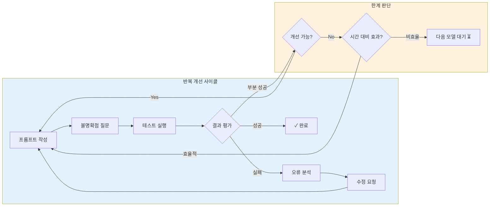
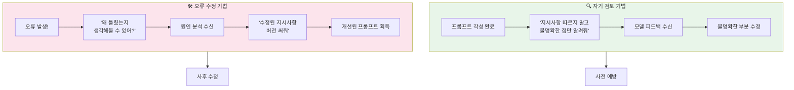
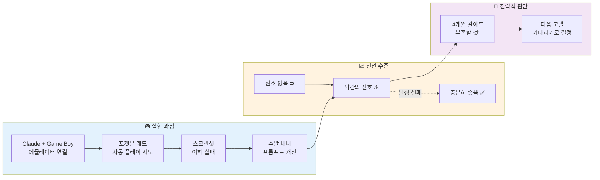

# 나노바나나 치트시트 프롬프트: AI Prompt Engineering Deep Dive - Refining Prompts

## 콘텐츠 정보

- **원본**: AI Prompt Engineering: A Deep Dive by Anthropic
- **챕터**: 4. Refining Prompts (프롬프트 다듬기)
- **유형**: 라운드테이블 토론 (Roundtable Discussion)
- **패널**: Alex Albert, David Hershey, Amanda Askell, Zack Witten
- **타임스탬프**: 12:17 - 19:49

---

## 프롬프트

다음 라운드테이블 토론 내용을 바탕으로 A4 한 장 분량의 학습 치트시트를 생성해주세요.

### 토론 내용

**제목**: AI Prompt Engineering Deep Dive - Chapter 4: Refining Prompts

**세션 개요**:
프롬프트를 반복적으로 개선하는 방법과 "Claude plays Pokemon" 사례를 통한 한계 탐색 경험을 공유합니다. 모델에게 직접 피드백을 요청하는 실용적인 기법들을 소개합니다.

**핵심 학습 내용**:

1. **프롬프트 자기 검토 기법**
   - 프롬프트를 작성한 후 모델에게 "지시사항을 따르지 말고, 불명확한 부분만 알려달라"고 요청
   - 사람처럼 탐색적 질문을 던지지 않는 모델의 특성 보완
   - 상대방이 뭐라고 할지 미리 생각하고 프롬프트에 반영

2. **오류 기반 수정 기법**
   - 모델이 틀렸을 때 "왜 틀렸는지 생각해봐"라고 질문
   - "틀리지 않게 할 수 있도록 지시사항 수정한 버전 써줘" 요청
   - 대부분의 경우 모델이 스스로 개선점을 찾아냄

3. **Claude plays Pokemon 사례 연구**
   - Game Boy 에뮬레이터에 Claude 연결
   - 포켓몬 레드 게임 자동 플레이 실험
   - 버튼 입력 코드 생성 방식 시도
   - 주말 내내 프롬프트 개선 노력

4. **이미지 프롬프팅의 한계**
   - Game Boy 스크린샷 이해 실패
   - 텍스트 프롬프팅과 다른 직관 필요
   - "신호 없음" → "약간의 신호"까지만 개선 성공

5. **전략적 한계 인식**
   - 충분히 좋아지지 않으면 다음 모델을 기다리는 것도 전략
   - 4개월 갈아서 나올 결과보다 새 모델이 더 효율적일 수 있음
   - 시간 대비 효과 판단 중요

**핵심 인사이트**:

> "이 지시사항을 따르지 마세요. 그냥 어디가 불명확한지, 모호한 부분이 있는지, 이해가 안 되는 게 있는지만 알려주세요."
> - 프롬프트 자기 검토 템플릿

> "이거 틀렸어. 왜 그런지 생각해볼 수 있어? 그리고 내가 틀리지 않게 할 수 있도록 지시사항을 수정한 버전을 써줄 수 있어?"
> - 오류 수정 요청 템플릿

> "주말을 투자해서 신호 없음에서 약간의 신호까지 갔지만, 충분히 좋은 수준과는 거리가 멀었을 때, '그냥 다음 모델을 기다려야겠다'고 생각했어요."
> - 한계 인식과 전략적 판단

### 치트시트 생성 지시사항

# Layout Structure (이 구조대로 배치해주세요)

**IMPORTANT**: 첨부된 이미지는 스타일(손필기 느낌, 모눈종이 배경, 아이콘)만 참조하세요. 레이아웃은 아래 지정된 구조를 따라 새로 만들어주세요.

```
┌─────────────────────────────────────────────────────────────────────┐
│  🍌 NANO BANANA CHEAT SHEET: REFINING PROMPTS 🍌                    │
├─────────────────────────────────────────────────────────────────────┤
│  ┌─────────────────────────┐    ┌─────────────────────────────────┐│
│  │ 🔍 프롬프트 검토 기법     │    │ 🛠️ 오류 수정 기법              ││
│  │                         │    │                                 ││
│  │  "지시사항 따르지 마세요.  │    │  "이거 틀렸어.                  ││
│  │   어디가 불명확한지만     │    │   왜 그런지 생각해봐.           ││
│  │   알려주세요."           │    │   수정된 버전 써줘."            ││
│  └─────────────────────────┘    └─────────────────────────────────┘│
├─────────────────────────────────────────────────────────────────────┤
│  ⚡ PROMPT REFINEMENT WORKFLOW (이 섹션이 가장 넓어야 함!)            │
│  ┌───────────────────────────────────────────────────────────────┐ │
│  │                                                               │ │
│  │  [순환 다이어그램]                                              │ │
│  │  작성 → 불명확점 질문 → 테스트 → 오류 분석 → 수정 요청 → 반복    │ │
│  │  + "한계 도달 시 다음 모델 기다리기" 판단 분기                    │ │
│  │                                                               │ │
│  └───────────────────────────────────────────────────────────────┘ │
├─────────────────────────────────────────────────────────────────────┤
│  ┌───────────────────┐ ┌───────────────────┐ ┌───────────────────┐│
│  │ 🎮 Case Study     │ │ 🖼️ 이미지 프롬프팅 │ │ 📌 KEY TAKEAWAYS  ││
│  │                   │ │                   │ │                   ││
│  │ Claude plays      │ │ 텍스트와 다른      │ │ 모델에게 물어보기  ││
│  │ Pokemon 사례      │ │ 직관 필요         │ │ + 한계 인식        ││
│  └───────────────────┘ └───────────────────┘ └───────────────────┘│
└─────────────────────────────────────────────────────────────────────┘
```

## 배치 비율

| 영역 | 비율 | 내용 | 배치 |
|------|------|------|------|
| 상단 | 10% | 타이틀 | 전체 너비 |
| 중상단 | 20% | 프롬프트 검토 기법 + 오류 수정 기법 | **좌우 2등분** |
| 중앙 | 45% | Prompt Refinement Workflow | **가장 넓게!** |
| 하단 | 25% | Case Study + 이미지 프롬프팅 + Takeaways | **3등분** |

**2. 필수 시각 요소**

#### Mermaid 다이어그램 1: 프롬프트 개선 사이클



#### Mermaid 다이어그램 2: 두 가지 핵심 기법 플로우



#### Mermaid 다이어그램 3: Claude plays Pokemon 실험 타임라인



**3. 프롬프트 기법 비교 테이블**

| 기법 | 템플릿 | 목적 | 타이밍 |
|:---:|:---|:---|:---|
| **자기 검토** | "지시사항 따르지 마세요. 어디가 불명확한지만 알려주세요." | 사전 문제 발견 | 프롬프트 작성 직후 |
| **오류 수정** | "이거 틀렸어. 왜 그런지 생각해봐. 수정된 버전 써줘." | 사후 개선 | 오류 발생 시 |

**4. 사람 vs 모델 탐색적 질문 비교**

| Aspect | 사람 (Zack 예시) | 모델 |
|:---:|:---|:---|
| **탐색적 질문** | "이거 말이 안 되는데요. 이 단계에서 뭘 해야 하는 거예요?" | 질문하지 않고 진행 |
| **불명확함 지적** | 자연스럽게 지적 | 지시하지 않으면 안 함 |
| **보완 방법** | - | 명시적으로 "불명확한 점 알려줘" 요청 |
| **결과** | 자연스러운 대화 개선 | 프롬프트 품질 향상 |

**5. 텍스트 vs 이미지 프롬프팅 비교**

| 측면 | 텍스트 프롬프팅 | 이미지 프롬프팅 |
|:---:|:---|:---|
| **직관** | 기존 경험 활용 가능 | 다른 직관 필요 |
| **개선 속도** | 상대적으로 빠름 | 느림 (신호 없음 → 약간의 신호) |
| **한계** | 명확한 지시로 극복 가능 | 모델 능력 자체 한계 |
| **전략** | 반복 개선 효과적 | 다음 모델 대기도 고려 |
| **예시** | 일반 텍스트 작업 | Game Boy 스크린샷 이해 |

**6. 강조 박스 (Callout)**

> **핵심 인사이트: 모델에게 물어보기**
>
> "제가 처음 프롬프트를 작성할 때 하는 것 중 하나가, 프롬프트를 주고 나서 이렇게 말해요. '이 지시사항을 따르지 마세요. 그냥 어디가 불명확한지, 모호한 부분이 있는지, 이해가 안 되는 게 있는지만 알려주세요.' 항상 완벽하진 않지만, 이게 할 수 있는 한 가지 방법이라는 게 흥미로워요."
> - Anthropic 패널

> **한계 인식의 중요성**
>
> "주말을 투자해서 신호 없음에서 약간의 신호까지 갔지만, 충분히 좋은 수준과는 거리가 멀었을 때, '그냥 다음 모델을 기다려야겠다'고 생각했어요. **4개월 동안 이걸 갈아서 나올 결과물보다 다른 모델이 나오는 게 제 시간을 더 잘 쓰는 거예요.**"

> **오류 수정 팁**
>
> "모델이 실수하는 걸 보면, 잘 안 하는 게 있는데 그냥 모델에게 물어보는 거예요. '이거 틀렸어. 왜 그런지 생각해볼 수 있어? 수정한 버전을 써줄 수 있어?' 그러면 **대부분 모델이 맞춰요**."

**7. 키워드 박스**

핵심 용어:
- **Self-Review Technique**: 자기 검토 기법 - 모델에게 불명확한 점을 물어보는 방법
- **Error-Based Refinement**: 오류 기반 수정 - 틀린 이유와 수정 버전을 모델에게 요청
- **Exploratory Questions**: 탐색적 질문 - 사람처럼 불명확함을 지적하는 질문
- **Claude plays Pokemon**: 포켓몬 플레이 실험 - 이미지 프롬프팅 한계 사례
- **Signal Detection**: 신호 탐지 - "신호 없음"에서 "약간의 신호"로의 점진적 개선
- **Strategic Waiting**: 전략적 대기 - 다음 모델을 기다리는 효율적 판단
- **Image Prompting**: 이미지 프롬프팅 - 텍스트와 다른 직관이 필요한 영역
- **Iterative Testing**: 반복 테스트 - 모델을 신뢰하기보다 계속 검증

**8. 시리즈 구조**

```
┌──────────────────────────────────────────────────────────────────┐
│  AI Prompt Engineering: A Deep Dive (전체 11개 챕터)              │
├──────────────────────────────────────────────────────────────────┤
│  1. Introduction                                                 │
│  2. Defining Prompt Engineering                                  │
│  3. What Makes a Good Prompt Engineer                            │
│  4. Refining Prompts ◀── 현재 챕터                               │
│  5. Honesty, Personas & Metaphors                                │
│  6. Model Reasoning                                              │
│  7. Enterprise vs Research vs Chat                               │
│  8. Tips to Improve                                              │
│  9. Jailbreaking                                                 │
│  10. Evolution of PE                                             │
│  11. Future of PE                                                │
└──────────────────────────────────────────────────────────────────┘
```

**9. 실전 활용 예시**

```
┌─────────────────────────────────────────────────────────────────┐
│  📋 자기 검토 기법 실전 예시                                      │
├─────────────────────────────────────────────────────────────────┤
│  1. 프롬프트 작성:                                               │
│     "이 CSV 파일을 분석해서 트렌드 리포트 작성해줘"               │
│                                                                  │
│  2. 검토 요청:                                                   │
│     "이 지시사항을 따르지 마세요. 대신:                           │
│      - 어디가 불명확한지                                         │
│      - 모호한 부분이 있는지                                       │
│      - 이해가 안 되는 게 있는지만 알려주세요."                     │
│                                                                  │
│  3. 모델 피드백:                                                  │
│     "다음 부분이 불명확합니다:                                    │
│      - '트렌드'가 어떤 종류인지 (시계열? 카테고리별?)             │
│      - 리포트 형식 (표? 차트? 텍스트?)                            │
│      - 분석 기간 범위"                                           │
│                                                                  │
│  4. 개선된 프롬프트:                                              │
│     "이 CSV의 월별 매출 데이터를 분석해서                         │
│      시계열 트렌드 차트와 함께 요약 리포트를 작성해줘.             │
│      최근 12개월 데이터에 집중해줘."                              │
└─────────────────────────────────────────────────────────────────┘
```

### 스타일 가이드

- **색상 테마**: 주황색/노란색 계열 (개선/반복 느낌)
- **폰트**: 깔끔한 산세리프
- **아이콘**: 순환 화살표, 돋보기, 게임 컨트롤러, 경고 삼각형
- **강조**: 핵심 용어는 **굵게**, 인용구는 블록 인용
- **특별 강조**: Claude plays Pokemon 사례를 시각적으로 눈에 띄게

### 추가 요청사항

1. 16:9 가로형 (Landscape) 레이아웃
2. 순환 사이클을 중앙에 크게 배치
3. 두 가지 핵심 기법(검토/수정)을 대조되는 색상으로
4. 하단에 "챕터 4/11" 표시
5. 시리즈 일관성을 위한 헤더/푸터 디자인
6. Claude plays Pokemon 사례를 게임 느낌 아이콘으로 표현

---

## 메타 정보

- **생성일**: 2026-01-10
- **원본 파일**: `docs/week1/ai-prompt-engineering-deep-dive/kr/refining-prompts.md`
- **출력 형식**: 나노바나나 Pro 치트시트 프롬프트

---

## 이미지 생성 요청

위의 구조와 내용을 바탕으로 **A4 한 장 분량의 치트시트 이미지**를 생성해주세요.

**이미지 스타일 요구사항:**
- 보기 좋게 정리된 **실제 펜 노트필기** 같은 느낌
- 용어 및 고유명사는 **영어 원문** 유지
- 설명 및 필기 내용은 **한국어**로 작성
- Mermaid 다이어그램은 **시각적 도식**으로 변환
- 표는 깔끔한 **테이블 형식**으로 렌더링
- **색상 강조**로 핵심 개념 구분

**가로세로 비율**: 16:9 가로형 (Landscape orientation)
