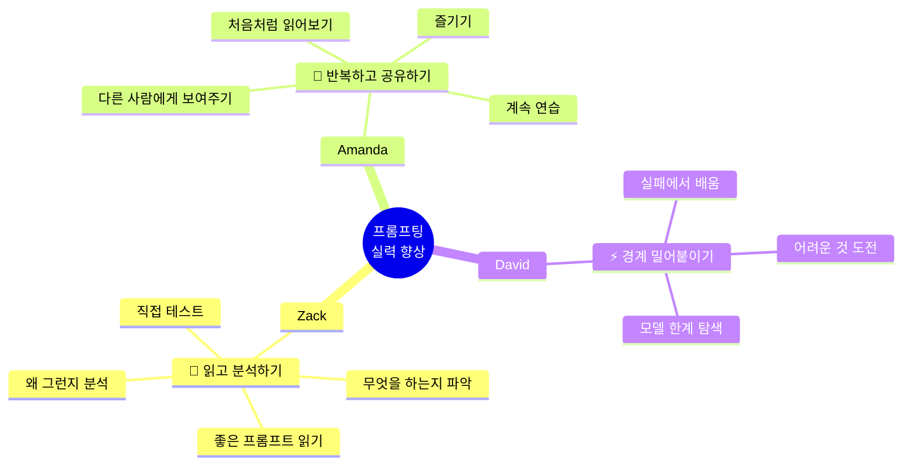
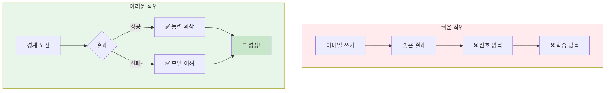
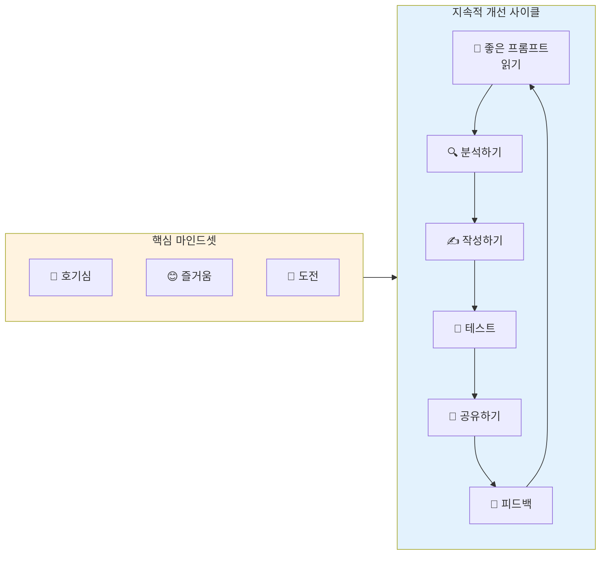

# 나노바나나 치트시트 프롬프트: AI Prompt Engineering Deep Dive - Tips to Improve Prompting

## 콘텐츠 정보

- **원본**: AI Prompt Engineering: A Deep Dive by Anthropic
- **챕터**: 8. Tips to Improve Prompting Skills (프롬프팅 실력 향상 팁)
- **유형**: 라운드테이블 토론 (Roundtable Discussion)
- **패널**: Alex Albert, David Hershey, Amanda Askell, Zack Witten
- **타임스탬프**: 50:52
- **영상 URL**: https://www.youtube.com/watch?v=T9aRN5JkmL8&t=3052s

---

## 프롬프트

다음 라운드테이블 토론 내용을 바탕으로 A4 한 장 분량의 학습 치트시트를 생성해주세요.

### 토론 내용

**제목**: AI Prompt Engineering Deep Dive - Chapter 8: Tips to Improve Prompting Skills

**세션 개요**:
Anthropic의 세 명의 프롬프트 엔지니어링 전문가가 각자의 관점에서 프롬프팅 실력 향상을 위한 핵심 팁을 공유합니다. 읽기와 분석, 반복적 연습과 공유, 그리고 경계를 밀어붙이는 도전에 대해 논의합니다.

**핵심 학습 내용**:

1. **Zack의 팁: 읽고 분석하기 (Read & Analyze)**
   - 좋은 프롬프트를 볼 때마다 자세히 읽어보기
   - 그 프롬프트가 **무엇을 하는지** 파악하기
   - **왜** 그렇게 작성되었는지 분석하기
   - 직접 **테스트**해보며 검증하기
   - 모델 출력도 주의 깊게 읽기

2. **Amanda의 팁: 반복하고, 공유하고, 즐기기 (Iterate, Share & Enjoy)**
   - **반복**해서 계속 연습하기
   - 프롬프트를 **다른 사람에게 보여주기**
   - 특히 프롬프트 엔지니어링을 **모르는 사람**에게 보여주기
   - 처음 접하는 사람처럼 **자신의 프롬프트 읽어보기**
   - **호기심**과 **즐거움**이 실력 향상의 핵심
   - 재미있다고 느끼는 사람들이 잘하게 됨

3. **David의 팁: 경계 밀어붙이기 (Push the Boundaries)**
   - 모델이 **할 수 없다고 생각하는 것** 시켜보기
   - 가장 **어려운 것**에 도전하기
   - **쉬운 것**은 프롬프트 엔지니어가 필요 없음
   - 너무 사소한 것은 신호를 얻을 수 없음
   - **실패해도** 모델 작동 방식에 대해 많이 배움
   - PE의 핵심은 **모델 능력의 경계**를 탐색하는 것

4. **공통 인사이트**
   - 쉬운 작업 → 누구나 할 수 있음, 학습 신호 없음
   - 어려운 작업 → 실패하더라도 깊이 있는 학습
   - 실패는 끝이 아니라 **학습 기회**

5. **핵심 인사이트**
   > "프롬프트를 읽고, 모델 출력을 읽으세요. 좋은 프롬프트를 볼 때마다 더 자세히 읽어보고, 무엇을 하는지, 왜 그런지 분석해봅니다." - Zack

   > "정말 호기심이 있고 관심이 있고 재미있다고 느낀다면... 실제로 그걸 즐기기 때문에 잘하게 됩니다." - Amanda

   > "모델이 할 수 있다고 생각하는 것의 경계를 밀어붙이는 무언가를 찾아보세요. 실패해도 모델이 어떻게 작동하는지에 대해 많이 배웁니다." - David

### 치트시트 생성 지시사항

# Layout Structure (이 구조대로 배치해주세요)

**IMPORTANT**: 첨부된 이미지는 스타일(손필기 느낌, 모눈종이 배경, 아이콘)만 참조하세요. 레이아웃은 아래 지정된 구조를 따라 새로 만들어주세요.

```
┌─────────────────────────────────────────────────────────────────────┐
│  🍌 NANO BANANA CHEAT SHEET: TIPS TO IMPROVE PROMPTING 🍌           │
├─────────────────────────────────────────────────────────────────────┤
│  ┌─────────────────────────┐    ┌─────────────────────────────────┐│
│  │ 📖 TIP 1: READ & ANALYZE│    │ 🔄 TIP 2: ITERATE & SHARE       ││
│  │         - Zack         │    │         - Amanda                ││
│  │                         │    │                                 ││
│  │  좋은 프롬프트 읽기       │    │  반복하고                       ││
│  │  무엇을 하는지 분석       │    │  다른 사람에게 보여주고          ││
│  │  왜 그런지 이해          │    │  즐기기!                        ││
│  │  직접 테스트해보기        │    │  호기심이 실력을 만든다          ││
│  └─────────────────────────┘    └─────────────────────────────────┘│
├─────────────────────────────────────────────────────────────────────┤
│  ⚡ TIP 3: PUSH THE BOUNDARIES - David (이 섹션이 가장 넓어야 함!)    │
│  ┌───────────────────────────────────────────────────────────────┐ │
│  │                                                               │ │
│  │  🎯 모델이 못할 것 같은 가장 어려운 것에 도전하기                 │ │
│  │                                                               │ │
│  │  ✓ 쉬운 것은 PE가 필요 없음                                    │ │
│  │  ✓ 사소한 것은 신호를 얻을 수 없음                              │ │
│  │  ✓ 경계를 밀어붙여야 진짜 배움                                  │ │
│  │  ✓ 실패해도 모델 작동 방식을 이해하게 됨                        │ │
│  │                                                               │ │
│  │  "프롬프트 엔지니어링의 많은 부분이 실제로는 모델이 할 수 있는   │ │
│  │   것의 경계를 밀어붙이는 것에 관한 것입니다."                    │ │
│  │                                                               │ │
│  └───────────────────────────────────────────────────────────────┘ │
├─────────────────────────────────────────────────────────────────────┤
│  ┌───────────────────┐ ┌───────────────────┐ ┌───────────────────┐│
│  │ 💡 WHY IT WORKS   │ │ ⚠️ COMMON TRAP    │ │ 📌 KEY TAKEAWAYS  ││
│  │                   │ │                   │ │                   ││
│  │ 즐겨야 잘하게 됨   │ │ 쉬운 것만 하기    │ │ 읽기 + 반복       ││
│  │ 호기심이 핵심     │ │ → 신호 없음       │ │ + 경계 밀어붙이기  ││
│  │ 실패가 학습      │ │ → 성장 없음       │ │ + 실패 수용       ││
│  └───────────────────┘ └───────────────────┘ └───────────────────┘│
└─────────────────────────────────────────────────────────────────────┘
```

## 배치 비율

| 영역 | 비율 | 내용 | 배치 |
|------|------|------|------|
| 상단 | 10% | 타이틀 | 전체 너비 |
| 중상단 | 20% | Tip 1 + Tip 2 | **좌우 2등분** |
| 중앙 | 45% | Tip 3: Push the Boundaries | **가장 넓게!** |
| 하단 | 25% | Why It Works + Common Trap + Takeaways | **3등분** |

**2. 필수 시각 요소**

#### Mermaid 다이어그램 1: 세 가지 팁 마인드맵



#### Mermaid 다이어그램 2: 학습 효과 플로우



#### Mermaid 다이어그램 3: 프롬프트 개선 사이클



**3. 전문가별 팁 비교 테이블**

| 전문가 | 핵심 팁 | 방법론 | 이유 |
|:---:|:---|:---|:---|
| **Zack** | 읽고 분석하기 | 좋은 프롬프트 → 왜 좋은지 분석 → 테스트 | 다른 사람의 노하우 흡수 |
| **Amanda** | 반복 + 공유 + 즐기기 | 연습 → 피드백 → 처음처럼 읽기 | 호기심과 재미가 실력으로 |
| **David** | 경계 밀어붙이기 | 어려운 것 도전 → 실패해도 배움 | PE의 본질은 한계 탐색 |

**4. 쉬운 작업 vs 어려운 작업 비교**

| 측면 | 쉬운 작업 | 어려운 작업 |
|:---:|:---|:---|
| **예시** | "좋은 이메일 써줘" | 모델 한계에 도전하는 과제 |
| **결과** | 항상 좋은 출력 | 성공 또는 실패 |
| **신호** | ❌ 없음 | ✅ 풍부함 |
| **학습량** | 거의 없음 | 매우 많음 |
| **PE 필요성** | 누구나 가능 | 전문성 필요 |
| **성장** | ❌ 정체 | ✅ 발전 |

**5. 실력 향상 마인드셋 비교**

| 마인드셋 | 설명 | 효과 |
|:---:|:---|:---|
| **호기심** | 왜 이렇게 동작하는지 궁금해하기 | 깊이 있는 이해 |
| **즐거움** | 프롬프팅 자체를 재미있어하기 | 지속적 연습 동기 |
| **도전** | 어려운 것을 피하지 않기 | 한계 확장 |
| **개방성** | 다른 사람에게 보여주고 피드백 받기 | 맹점 발견 |
| **끈기** | 실패에서도 배움을 찾기 | 성장 마인드셋 |

**6. 강조 박스 (Callout)**

> **핵심 인사이트: 경계를 밀어붙여라**
>
> "모델이 할 수 있다고 생각하는 것의 **경계를 밀어붙이는** 무언가를 찾거나 생각해낼 수 있다면요. 프롬프트 엔지니어링의 많은 부분이 실제로는 **모델이 할 수 있는 것의 경계를 밀어붙이는 것**에 관한 거라고 생각해요. 쉬운 것들은 프롬프트 엔지니어가 아니어도 할 수 있으니까요. 생각할 수 있는 **가장 어려운 것**을 찾아서 해보세요. **실패하더라도** 모델이 어떻게 작동하는지에 대해 많이 배우게 되거든요."
> - David Hershey

> **실패의 가치**
>
> 프롬프트 엔지니어링에서 실패는 끝이 아니라 **시작**입니다. 어려운 과제에 도전하고 실패할 때, 우리는 모델의 **진짜 한계**와 **작동 방식**을 이해하게 됩니다.

**7. 키워드 박스**

핵심 용어:
- **Read & Analyze (읽고 분석하기)**: Zack의 팁 - 좋은 프롬프트를 읽고 왜 좋은지 분석하는 방법
- **Iterate & Share (반복하고 공유하기)**: Amanda의 팁 - 꾸준히 연습하고 피드백 받는 방법
- **Push the Boundaries (경계 밀어붙이기)**: David의 팁 - 모델의 한계에 도전하여 배우는 방법
- **Learning Signal (학습 신호)**: 프롬프트가 좋은지 나쁜지 판단할 수 있는 피드백
- **Growth Mindset (성장 마인드셋)**: 실패를 학습 기회로 보는 관점
- **Curiosity-Driven Learning (호기심 기반 학습)**: 재미와 관심이 실력으로 이어지는 원리
- **Fresh Eyes (새로운 시선)**: 처음 접하는 사람처럼 자신의 프롬프트를 읽어보기

**8. 액션 아이템**

1. **오늘부터 시작**: 좋은 프롬프트 예시 3개를 모아서 분석하기
2. **이번 주 목표**: 동료나 친구에게 프롬프트 보여주고 피드백 받기
3. **도전 과제**: "모델이 못할 것 같은" 어려운 작업 하나 시도하기
4. **마인드셋**: 실패해도 괜찮다 - 그 과정에서 배우는 것이 핵심

**9. 시리즈 구조**

```
┌──────────────────────────────────────────────────────────────────┐
│  AI Prompt Engineering: A Deep Dive (전체 11개 챕터)              │
├──────────────────────────────────────────────────────────────────┤
│  1. Introduction                                                 │
│  2. Defining Prompt Engineering                                  │
│  3. What Makes a Good Prompt Engineer                            │
│  4. Refining Prompts                                             │
│  5. Honesty, Personas & Metaphors                                │
│  6. Model Reasoning                                              │
│  7. Enterprise vs Research vs Chat                               │
│  8. Tips to Improve Prompting Skills ◀── 현재 챕터               │
│  9. Jailbreaking                                                 │
│  10. Evolution of PE                                             │
│  11. Future of PE                                                │
└──────────────────────────────────────────────────────────────────┘
```

### 스타일 가이드

- **색상 테마**: 주황/노랑 계열 (활력/성장 느낌) + 녹색 (성장/발전)
- **폰트**: 깔끔한 산세리프
- **아이콘**: 책(📖), 순환 화살표(🔄), 번개(⚡), 타겟(🎯), 전구(💡)
- **강조**: 핵심 용어는 **굵게**, 인용구는 블록 인용
- **레이아웃**: 세 팁을 시각적으로 구분하되, David의 "경계 밀어붙이기"를 가장 크게

### 추가 요청사항

1. 16:9 가로형 (Landscape) 레이아웃
2. 세 전문가의 팁을 각각 다른 색상으로 구분
3. "경계 밀어붙이기" 섹션을 시각적으로 강조 (테두리, 배경색)
4. 하단에 "챕터 8/11" 표시
5. 시리즈 일관성을 위한 헤더/푸터 디자인

---

## 메타 정보

- **생성일**: 2026-01-11
- **원본 파일**: `docs/week1/ai-prompt-engineering-deep-dive/kr/tips-to-improve-prompting.md`
- **출력 형식**: 나노바나나 Pro 치트시트 프롬프트

---

## 이미지 생성 요청

위의 구조와 내용을 바탕으로 **A4 한 장 분량의 치트시트 이미지**를 생성해주세요.

**이미지 스타일 요구사항:**
- 보기 좋게 정리된 **실제 펜 노트필기** 같은 느낌
- 용어 및 고유명사는 **영어 원문** 유지
- 설명 및 필기 내용은 **한국어**로 작성
- Mermaid 다이어그램은 **시각적 도식**으로 변환
- 표는 깔끔한 **테이블 형식**으로 렌더링
- **색상 강조**로 각 전문가의 팁 구분 (Zack: 파랑, Amanda: 보라, David: 주황)

**가로세로 비율**: 16:9 가로형 (Landscape orientation)
