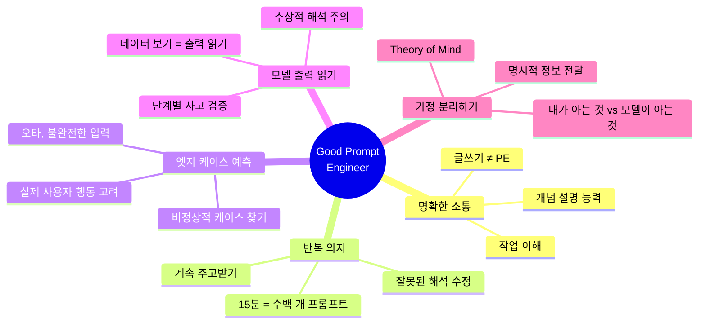
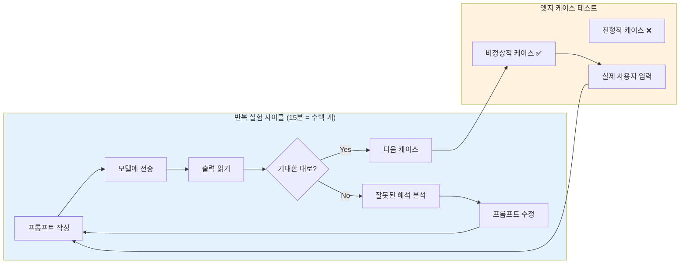
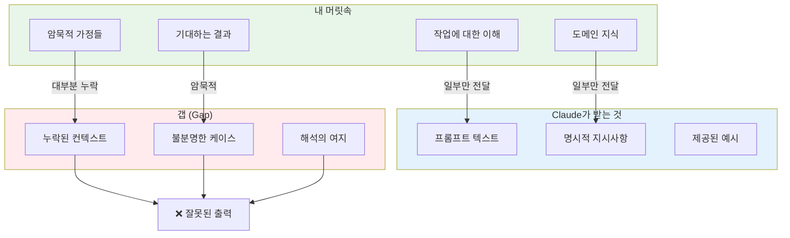

# 나노바나나 치트시트 프롬프트: AI Prompt Engineering Deep Dive - What Makes a Good Prompt Engineer

## 콘텐츠 정보

- **원본**: AI Prompt Engineering: A Deep Dive by Anthropic
- **챕터**: 3. What Makes a Good Prompt Engineer (좋은 프롬프트 엔지니어의 조건)
- **유형**: 라운드테이블 토론 (Roundtable Discussion)
- **패널**: Alex Albert, David Hershey, Amanda Askell, Zack Witten

---

## 프롬프트

다음 라운드테이블 토론 내용을 바탕으로 A4 한 장 분량의 학습 치트시트를 생성해주세요.

### 토론 내용

**제목**: AI Prompt Engineering Deep Dive - Chapter 3: What Makes a Good Prompt Engineer

**세션 개요**:
좋은 프롬프트 엔지니어에게 필요한 핵심 역량을 논의합니다. 글쓰기 능력보다 개념 설명 능력이 더 중요하며, 반복적인 테스트와 엣지 케이스 예측, 모델 출력 읽기, 그리고 마음 이론(Theory of Mind)의 중요성을 다룹니다.

**핵심 학습 내용**:

1. **흔한 오해: 좋은 작가 = 좋은 프롬프트 엔지니어?**
   - 많은 사람들이 "프롬프트 엔지니어"라는 명칭에 의문을 가짐
   - "그냥 작가라고 하면 안 돼?"라는 주장이 있음
   - **실제로는 글쓰기 능력과 PE 능력의 상관관계가 높지 않음**
   - 명확한 의사소통 = 개념을 잘 생각하고 설명하는 능력

2. **핵심 역량 5가지**
   - **명확한 소통**: 작업을 명확히 이해하고 개념을 잘 설명
   - **반복 의지**: 15분에 수백 개의 프롬프트를 주고받으며 개선
   - **엣지 케이스 예측**: 전형적 케이스가 아닌 비정상적 케이스를 찾아 테스트
   - **모델 출력 읽기**: "단계별로 생각해"라고 했을 때 실제로 그러는지 확인
   - **가정 분리하기**: 자신이 아는 것과 Claude가 모르는 것 구분

3. **반복(Iteration)의 중요성**
   - "한 번 쓰면 끝"이라고 생각하면 안 됨
   - 15분 동안 수백 개의 프롬프트를 모델에 보냄
   - 계속 주고받고, 주고받고, 주고받고
   - 무엇이 잘못 해석됐는지 살펴보고 수정

4. **엣지 케이스 사고방식**
   - 400개 케이스에 적용할 프롬프트가 있다면...
   - ❌ 전형적인 케이스만 테스트하고 넘어가기
   - ✅ "이 경우에 내가 뭘 해야 할지 정말 불분명한 케이스는?"
   - 실제 사용자: Shift 키도 안 쓰고, 오타 많고, 질문 형식 아님

5. **모델 출력 읽기 = 데이터 보기**
   - ML에서 "데이터를 봐라"와 같은 원칙
   - 프롬프팅에서는 "모델 출력을 읽어라"
   - 예: "단계별로 생각해"라고 했을 때 모델이 실제로 그러는지 확인
   - 모델이 더 추상적/일반적 의미로 받아들일 수 있음

6. **마음 이론 (Theory of Mind)**
   - 모델이 내 지시사항을 어떻게 볼지 생각
   - Enterprise 케이스: 사용자가 모델에게 어떻게 말할지도 고려
   - 자기 머릿속에서 알지만 Claude는 모르는 모든 것을 풀어내기
   - 가지고 있는 모든 가정을 벗겨내고 명시적으로 전달

**핵심 인사이트**:
> "좋은 작가가 되는 것이 사람들이 생각하는 것만큼 좋은 프롬프트 엔지니어가 되는 것과 상관관계가 높지 않다고 생각해요." - Amanda

> "15분 동안 수백 개의 프롬프트를 모델에 보냈어요. 계속 주고받고, 주고받고, 주고받고." - Amanda

> "전형적인 케이스가 아닌 비정상적인 케이스를 찾아라." - Amanda

> "머신러닝에서 데이터를 보라고 하는데, 프롬프팅에서 그에 해당하는 건 모델 출력을 읽는 거예요." - Zack

> "자기가 아는 것만 적지 말고, 모델이 알아야 할 전체 정보를 체계적으로 분해해서 적어라." - Amanda

---

### 치트시트 생성 지시사항

# Layout Structure (이 구조대로 배치해주세요)

**IMPORTANT**: 첨부된 이미지는 스타일(손필기 느낌, 모눈종이 배경, 아이콘)만 참조하세요. 레이아웃은 아래 지정된 구조를 따라 새로 만들어주세요.

```
┌─────────────────────────────────────────────────────────────────────┐
│  🍌 NANO BANANA CHEAT SHEET: GOOD PROMPT ENGINEER 🍌                │
├─────────────────────────────────────────────────────────────────────┤
│  ┌─────────────────────────┐    ┌─────────────────────────────────┐│
│  │ ❌ 흔한 오해             │    │ ✅ 진짜 중요한 것               ││
│  │                         │    │                                 ││
│  │  좋은 작가 =             │    │  개념 설명 능력                  ││
│  │  좋은 PE (X)             │    │  반복 + 테스트 의지              ││
│  │                         │    │  마음 이론 (Theory of Mind)      ││
│  └─────────────────────────┘    └─────────────────────────────────┘│
├─────────────────────────────────────────────────────────────────────┤
│  ⚡ 5 KEY COMPETENCIES (이 섹션이 가장 넓어야 함!)                   │
│  ┌───────────────────────────────────────────────────────────────┐ │
│  │                                                               │ │
│  │  1. 명확한 소통   2. 반복 의지   3. 엣지 케이스 예측            │ │
│  │  4. 모델 출력 읽기   5. 가정 분리하기                           │ │
│  │  [각 역량을 아이콘과 함께 카드 형태로 배치]                      │ │
│  │                                                               │ │
│  └───────────────────────────────────────────────────────────────┘ │
├─────────────────────────────────────────────────────────────────────┤
│  ┌───────────────────┐ ┌───────────────────┐ ┌───────────────────┐│
│  │ 🧠 Theory of Mind │ │ ⚠️ 흔한 실수       │ │ 📌 KEY TAKEAWAYS  ││
│  │                   │ │                   │ │                   ││
│  │ 모델이 내 지시를   │ │ 전형적 케이스만    │ │ 반복 + 엣지케이스  ││
│  │ 어떻게 볼지 생각   │ │ 테스트함          │ │ + 출력 읽기        ││
│  └───────────────────┘ └───────────────────┘ └───────────────────┘│
└─────────────────────────────────────────────────────────────────────┘
```

## 배치 비율

| 영역 | 비율 | 내용 | 배치 |
|------|------|------|------|
| 상단 | 10% | 타이틀 | 전체 너비 |
| 중상단 | 20% | 흔한 오해 + 진짜 중요한 것 | **좌우 2등분** |
| 중앙 | 45% | 5 Key Competencies | **가장 넓게!** |
| 하단 | 25% | Theory of Mind + 흔한 실수 + Takeaways | **3등분** |

**2. 필수 시각 요소**

#### Mermaid 다이어그램 1: 5 Key Competencies 마인드맵



#### Mermaid 다이어그램 2: 반복 프로세스 플로우



#### Mermaid 다이어그램 3: Theory of Mind 개념도



**3. 흔한 오해 vs 진짜 중요한 것 비교 테이블**

| 흔한 오해 ❌ | 진짜 중요한 것 ✅ |
|:---|:---|
| 좋은 작가 = 좋은 PE | 개념 설명 능력 |
| 한 번 작성하면 끝 | 15분에 수백 개 반복 |
| 전형적 케이스만 테스트 | 엣지 케이스 찾기 |
| 출력 결과만 확인 | 출력을 꼼꼼히 읽기 |
| 자기가 아는 것 적기 | 모델이 알아야 할 것 적기 |

**4. 5가지 핵심 역량 상세 테이블**

| # | 역량 | 설명 | 실제 예시 | 안티패턴 |
|:---:|:---|:---|:---|:---|
| 1 | **명확한 소통** | 개념을 명확하게 설명 | 작업의 본질 이해 후 전달 | 애매한 표현 사용 |
| 2 | **반복 의지** | 계속 주고받으며 개선 | 15분에 수백 개 프롬프트 | 한 번 작성 후 포기 |
| 3 | **엣지 케이스 예측** | 비정상적 케이스 찾기 | "이 경우엔 뭘 해야 할지 불분명한 케이스는?" | 전형적 케이스만 테스트 |
| 4 | **모델 출력 읽기** | 실제 응답 꼼꼼히 확인 | "단계별로 생각해" → 실제로 그러는지 검증 | 결과만 보고 넘어감 |
| 5 | **가정 분리하기** | 내가 아는 것 vs 모델이 아는 것 | 모든 암묵적 가정 명시화 | 자기가 아는 것만 적음 |

**5. 실제 사용자 vs 이상적 사용자 비교**

| 측면 | 이상적 사용자 (기대) | 실제 사용자 (현실) |
|:---:|:---|:---|
| **입력 형식** | 완벽하게 구성된 문장 | 단어 두세 개만 입력 |
| **대소문자** | 적절한 대소문자 사용 | Shift 키도 안 씀 |
| **오타** | 없음 | 단어 두 개 중 하나는 오타 |
| **질문 형식** | 명확한 질문 | 질문 없이 그냥 단어 입력 |
| **사고방식** | 대화한다고 생각 | 구글 검색처럼 생각 |

**6. 강조 박스 (Callout)**

> **핵심 인사이트: 반복의 본질**
>
> "사람들은 한 번 쓰면 끝이라고 생각해요. 그런데 15분 동안 **수백 개**의 프롬프트를 모델에 보냈어요. 계속 **주고받고, 주고받고, 주고받고**. 그래서 반복하려는 의지와 여기서 **무엇이 잘못 해석됐는지** 살펴보고 생각하는 것, 그리고 그걸 고치는 거예요."
> - Amanda Askell

> **Theory of Mind의 어려움**
>
> "작업에 대한 지시사항을 적는 게 정말 어려워요. 자기 머릿속에서 알고 있지만 **Claude는 모르는** 모든 것을 풀어내서 적는 게 정말 어려워요. 가지고 있는 **모든 가정을 벗겨내고** 모델에게 필요한 전체 정보를 아주 명확하게 전달하는 건 엄청나게 도전적인 일이에요."
> - Amanda Askell

> **프롬프팅에서의 "데이터 보기"**
>
> "머신러닝에서는 데이터를 봐야 한다고 하잖아요. 프롬프팅에서 그에 해당하는 건 **모델 출력을 보는 거**라고 생각해요. 그냥 많은 출력을 읽고 자세히 읽는 거예요."
> - Zack Witten

**7. 키워드 박스**

핵심 용어:
- **Clear Communication**: 명확한 소통 - 글쓰기 능력이 아닌 개념 설명 능력
- **Iteration**: 반복 - 15분에 수백 개의 프롬프트를 주고받는 과정
- **Edge Cases**: 엣지 케이스 - 전형적이 아닌 비정상적인 테스트 케이스
- **Reading Model Output**: 모델 출력 읽기 - ML의 "데이터 보기"에 해당
- **Theory of Mind**: 마음 이론 - 모델이 내 지시를 어떻게 볼지 생각하는 능력
- **Assumption Separation**: 가정 분리 - 내가 아는 것과 모델이 모르는 것 구분
- **Enterprise Context**: 기업 환경 - 실제 사용자 행동 (오타, 불완전한 입력) 고려

**8. 시리즈 구조**

```
┌──────────────────────────────────────────────────────────┐
│  AI Prompt Engineering: A Deep Dive (전체 11개 챕터)      │
├──────────────────────────────────────────────────────────┤
│  1. Introduction                                         │
│  2. Defining Prompt Engineering                          │
│  3. What Makes a Good Prompt Engineer ◀── 현재 챕터      │
│  4. Refining Prompts                                     │
│  5. Honesty, Personas & Metaphors                        │
│  6. Model Reasoning                                      │
│  7. Enterprise vs Research vs Chat                       │
│  8. Tips to Improve                                      │
│  9. Jailbreaking                                         │
│  10. Evolution of PE                                     │
│  11. Future of PE                                        │
└──────────────────────────────────────────────────────────┘
```

### 스타일 가이드

- **색상 테마**: 주황색/노란색 계열 (역량/스킬 강조 느낌)
- **폰트**: 깔끔한 산세리프
- **아이콘**: 체크마크, X 표시, 뇌, 반복 화살표, 돋보기
- **강조**: 핵심 용어는 **굵게**, 인용구는 블록 인용

### 추가 요청사항

1. 16:9 가로형 (Landscape) 레이아웃
2. 5가지 핵심 역량을 카드 형태로 시각적 강조
3. 하단에 "챕터 3/11" 표시
4. 시리즈 일관성을 위한 헤더/푸터 디자인

---

## 메타 정보

- **생성일**: 2026-01-10
- **원본 파일**: `docs/week1/ai-prompt-engineering-deep-dive/kr/what-makes-good-prompt-engineer.md`
- **출력 형식**: 나노바나나 Pro 치트시트 프롬프트

---

## 이미지 생성 요청

위의 구조와 내용을 바탕으로 **A4 한 장 분량의 치트시트 이미지**를 생성해주세요.

**이미지 스타일 요구사항:**
- 보기 좋게 정리된 **실제 펜 노트필기** 같은 느낌
- 용어 및 고유명사는 **영어 원문** 유지
- 설명 및 필기 내용은 **한국어**로 작성
- Mermaid 다이어그램은 **시각적 도식**으로 변환
- 표는 깔끔한 **테이블 형식**으로 렌더링
- **색상 강조**로 핵심 개념 구분

**가로세로 비율**: 16:9 가로형 (Landscape orientation)
