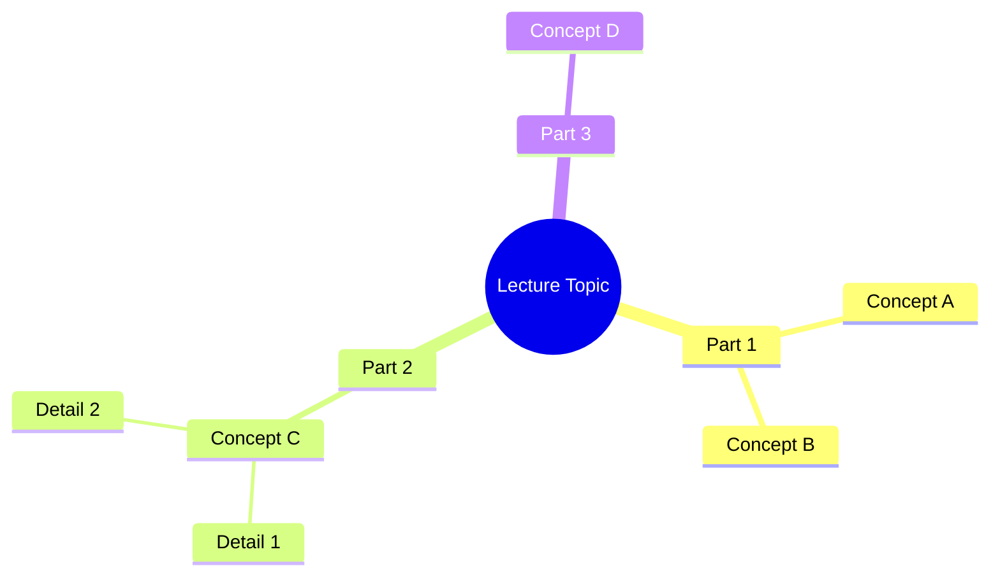
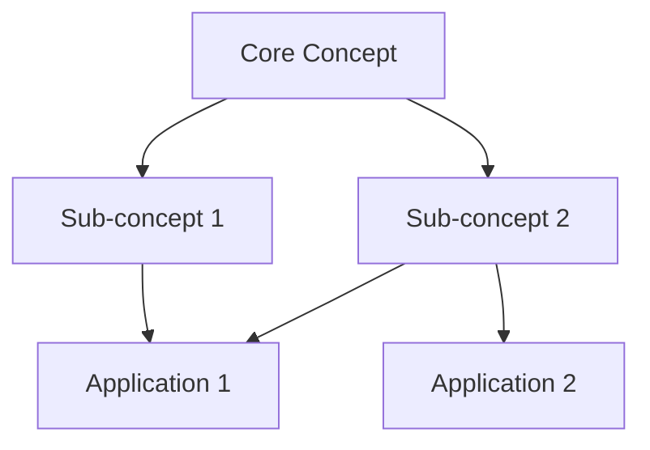
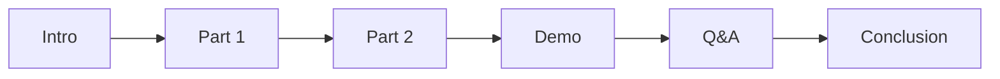

# Lecture Style Template

강의/프레젠테이션 콘텐츠 (예: YouTube 강의 트랜스크립트)를 위한 나노바나나 치트시트 템플릿

## 콘텐츠 특성

- 시간 순서대로 진행되는 내용
- 개념 설명 중심
- Q&A나 토론 포함 가능
- 데모/예시 포함

## Output Style 지침

```markdown
# Output Style: "Nano Banana" Cheat Sheet
Please adhere to the following formatting rules strictly:

1. **Visual Hierarchy & Structure**:
   - Use strict Markdown structure.
   - Use specific emojis for every section header to improve scanning.
   - Use **Bold** for key concepts and definitions.
   - Group by topic, not by timeline.

2. **Diagrams & Schematics (CRITICAL)**:
   - Use `mermaid` code blocks to visualize concepts.
   - Create a **Mind Map** for the overall topic structure.
   - Create **Flowcharts** for processes explained in the lecture.
   - Use **Class Diagrams** for concept relationships if applicable.

3. **Concept Tables**:
   - Key concepts in table format with definitions.
   - Compare/contrast tables for similar concepts.

4. **Quotable Insights**:
   - Extract memorable quotes or key insights.
   - Highlight "aha moments" from the lecture.
```

## Layout Structure (필수)

**IMPORTANT**: 첨부된 이미지는 스타일(손필기 느낌, 모눈종이 배경, 아이콘)만 참조하세요. 레이아웃은 아래 지정된 구조를 따라 새로 만들어주세요.

프롬프트에 반드시 아래와 같은 ASCII 레이아웃 다이어그램을 포함해야 합니다:

```
┌─────────────────────────────────────────────────────────────────────┐
│  🍌 NANO BANANA CHEAT SHEET: [주제명] 🍌                             │
├─────────────────────────────────────────────────────────────────────┤
│  ┌─────────────────────────┐    ┌─────────────────────────────────┐│
│  │ 📖 [좌측 상단 섹션]      │    │ 🎯 [우측 상단 섹션]              ││
│  │                         │    │                                 ││
│  │  핵심 개념 A 설명        │    │  핵심 개념 B 설명                ││
│  │                         │    │                                 ││
│  └─────────────────────────┘    └─────────────────────────────────┘│
├─────────────────────────────────────────────────────────────────────┤
│  ⚡ [핵심 섹션명] (이 섹션이 가장 넓어야 함!)                         │
│  ┌───────────────────────────────────────────────────────────────┐ │
│  │                                                                │ │
│  │  메인 다이어그램/핵심 비교 내용/Before-After 비교 등            │ │
│  │                                                                │ │
│  └───────────────────────────────────────────────────────────────┘ │
├─────────────────────────────────────────────────────────────────────┤
│  ┌───────────────────┐ ┌───────────────────┐ ┌───────────────────┐│
│  │ 💡 [하단 좌측]     │ │ 🔧 [하단 중앙]     │ │ 🎓 [하단 우측]    ││
│  │                   │ │                   │ │                   ││
│  │  인사이트/명언     │ │  실용적 팁        │ │  Key Takeaways   ││
│  └───────────────────┘ └───────────────────┘ └───────────────────┘│
└─────────────────────────────────────────────────────────────────────┘
```

### 배치 비율 (필수 명시)

- **상단 (10~15%)**: 타이틀
- **중상단 (20~25%)**: 핵심 개념 2개 (좌우 분할)
- **중앙 (35~45%)**: 메인 다이어그램/핵심 내용 (가장 넓게!)
- **하단 (20%)**: 요약/Takeaways (2~3등분)

### Instructions 섹션 (필수)

프롬프트 끝에 반드시 포함:

```markdown
# Instructions

1. **이미지 비율 (중요!)**: **A4 가로 방향(Landscape)** 또는 **16:9 비율**로 생성해주세요. 모니터 화면에 꽉 차는 가로형 레이아웃입니다. 세로(Portrait) 방향은 사용하지 마세요.

2. **스타일**: 첨부된 이미지의 손필기 느낌, 모눈종이 배경, 아이콘 스타일을 따라주세요.

3. **레이아웃**: 위의 ASCII 다이어그램 구조를 따라 새로 배치해주세요. 첨부 이미지의 레이아웃을 그대로 복사하지 마세요.

4. **언어**: 용어/고유명사는 영어, 설명은 한국어.

5. **핵심**: **[핵심 섹션명]을 가장 넓고 눈에 띄게** 배치해주세요.

Please generate the Cheat Sheet now.
```

## Output Structure Plan

```markdown
## 1. Topic Overview (Mind Map)
- Create a Mermaid mindmap showing all major topics covered.

## 2. Key Concepts Matrix
| Concept | Definition | Example | Related To |
|---------|------------|---------|------------|

## 3. Core Ideas (Flowchart/Diagram)
- Visual representation of the main argument or process.

## 4. Notable Insights
- Blockquotes with the most impactful statements.

## 5. Practical Applications
- How to apply what was learned.

## 6. Summary & Takeaways
- 3-5 bullet points summarizing the lecture.
```

## 섹션별 Mermaid 예시

### Topic Mind Map 예시


### Concept Relationship 예시


### Timeline 예시 (선택적)


## 언어 지침

- 용어 및 고유명사: 영어 원문 유지
- 설명 및 필기 내용: 한국어로 작성
- 인용문: 원문 영어 + 한국어 의역 병기 가능
- 예: "LLM의 핵심 개념", "Transformer Architecture 이해"
