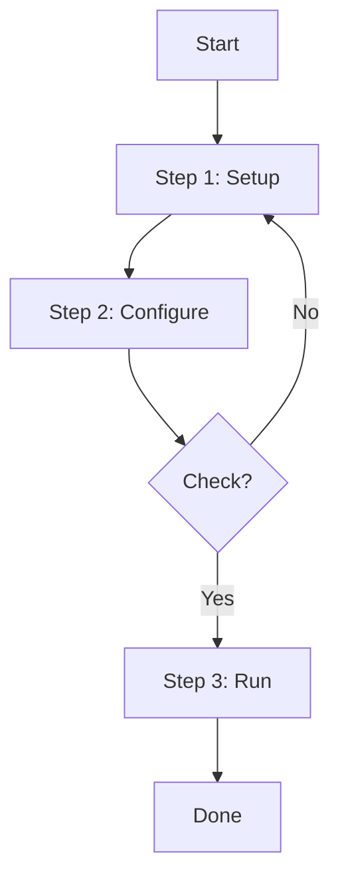
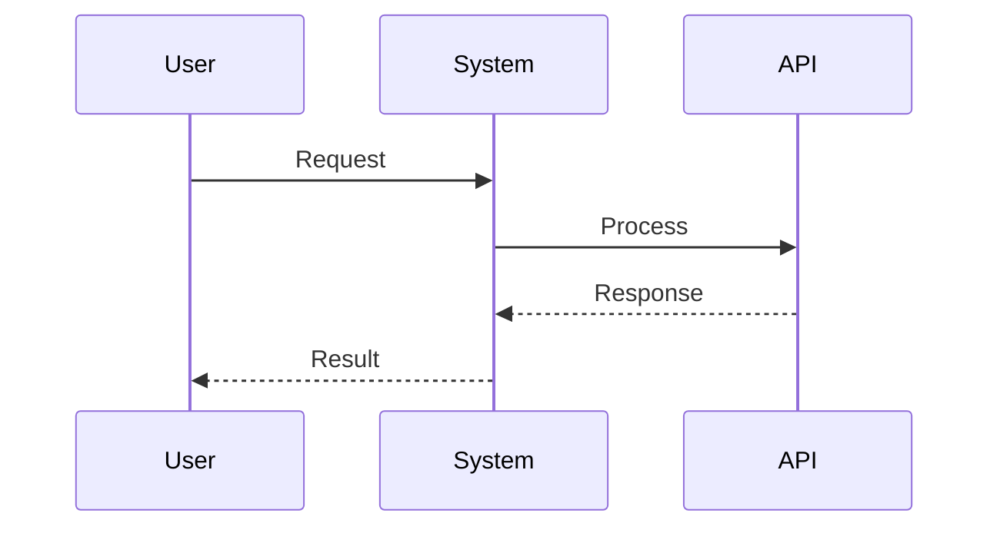

# Tutorial Style Template

단계별 가이드/튜토리얼 콘텐츠를 위한 나노바나나 치트시트 템플릿

## 콘텐츠 특성

- Step-by-step 구조
- 코드 예시 포함
- Prerequisites/요구사항 섹션
- 명령어나 설정 방법 포함

## Output Style 지침

```markdown
# Output Style: "Nano Banana" Cheat Sheet
Please adhere to the following formatting rules strictly:

1. **Visual Hierarchy & Structure**:
   - Use strict Markdown structure.
   - Use specific emojis for every section header to improve scanning.
   - Use **Bold** for key commands and configurations.
   - Number all steps clearly.

2. **Diagrams & Schematics (CRITICAL)**:
   - Use `mermaid` code blocks to visualize the workflow.
   - Create a **Flowchart** showing the step-by-step process.
   - Create a **Sequence Diagram** if there are interactions between components.

3. **Code & Commands**:
   - All commands in separate code blocks with language tags.
   - Group related commands together.
   - Add inline comments for complex commands.

4. **Quick Reference**:
   - Create a "Cheat Commands" section with the most used commands.
   - Include troubleshooting tips in a table format.
```

## Output Structure Plan

```markdown
## 1. Overview (Flowchart)
- Create a Mermaid flowchart showing the entire process from start to finish.

## 2. Prerequisites Checklist
- A checkbox list of requirements before starting.

## 3. Step-by-Step Guide (Table)
| Step | Action | Command/Code | Notes |
|------|--------|--------------|-------|

## 4. Cheat Commands
- Most frequently used commands in code blocks, categorized.

## 5. Troubleshooting
| Problem | Cause | Solution |
|---------|-------|----------|

## 6. Key Takeaways
- 2-3 most important things to remember.
```

## 섹션별 Mermaid 예시

### Process Flowchart 예시


### Sequence Diagram 예시


## 언어 지침

- 용어 및 고유명사: 영어 원문 유지
- 설명 및 필기 내용: 한국어로 작성
- 명령어/코드: 원문 그대로 유지
- 예: "npm install 실행", "config 파일 설정"

## 이미지 비율 지침 (중요!)

- **A4 가로 방향(Landscape)** 또는 **16:9 비율**로 생성
- 모니터 화면에 꽉 차는 가로형 레이아웃
- 세로(Portrait) 방향 사용 금지
