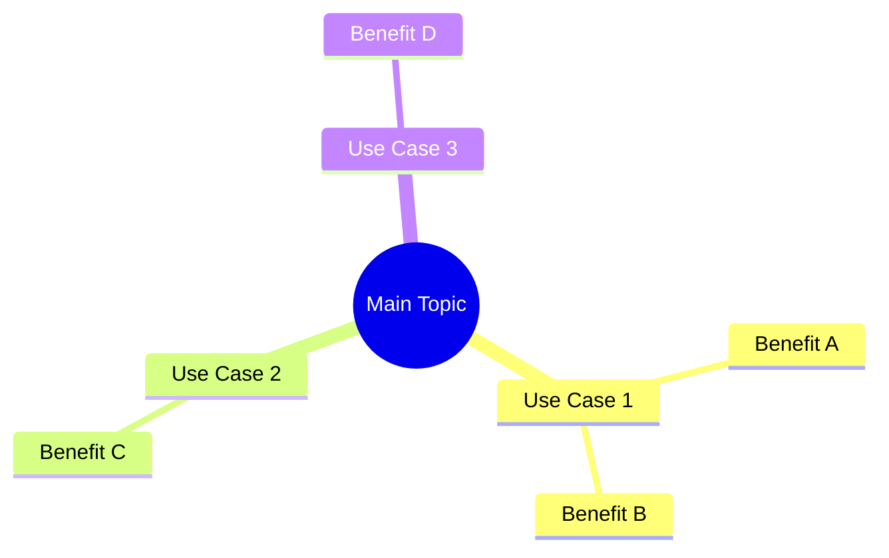

# Use Case Style Template

사례 중심 콘텐츠 (예: "How OpenAI Uses Codex")를 위한 나노바나나 치트시트 템플릿

## 콘텐츠 특성

- 여러 Use Case가 나열된 형태
- 각 사례마다 Anecdote/인용문 포함
- Sample Prompt나 예시가 있음
- Best Practices 섹션 포함

## Output Style 지침

```markdown
# Output Style: "Nano Banana" Cheat Sheet
Please adhere to the following formatting rules strictly:

1. **Visual Hierarchy & Structure**:
   - Use strict Markdown structure.
   - Use specific emojis for every section header to improve scanning.
   - Use **Bold** for key concepts and commands.
   - Group related information logically.

2. **Diagrams & Schematics (CRITICAL)**:
   - Use `mermaid` code blocks to visualize concepts.
   - Create a **Mind Map** for the overall structure of Use Cases.
   - Create a **Flowchart** for the "Best Practices" workflow.
   - Ensure diagrams are complex enough to be informative but simple enough to be read at a glance.

3. **Tabular Data**:
   - Convert the "Use Cases" section into a comprehensive Markdown Table.
   - Columns should be: [Use Case Context] | [Key Benefit] | [Example Scenario] | [Sample Prompt].

4. **Actionable Content**:
   - Extract "Sample prompts" into separate code blocks for easy copying.
   - Summarize "Best Practices" into a Checklist format (e.g., `[ ]`).
```

## Output Structure Plan

```markdown
## 1. Executive Summary (Mind Map)
- Create a Mermaid mindmap showing the core Use Cases and their primary value props.

## 2. Engineering Use Case Matrix (The Core)
- A detailed table summarizing all Use Cases.
- Focus on the "Problem -> Solution" dynamic.

## 3. Best Practices Workflow (Flowchart)
- A Mermaid flowchart connecting the recommended workflow steps.

## 4. Quick Reference: Golden Prompts
- List the most high-impact sample prompts from the text, categorized by function, inside code blocks.

## 5. Key Takeaways
- A 2-3 sentence summary and future outlook.
```

## 섹션별 Mermaid 예시

### Mind Map 예시


### Flowchart 예시


## 언어 지침

- 용어 및 고유명사: 영어 원문 유지
- 설명 및 필기 내용: 한국어로 작성
- 예: "Codex를 사용한 Code Understanding", "Performance Optimization 기법"

## 이미지 비율 지침 (중요!)

- **A4 가로 방향(Landscape)** 또는 **16:9 비율**로 생성
- 모니터 화면에 꽉 차는 가로형 레이아웃
- 세로(Portrait) 방향 사용 금지
